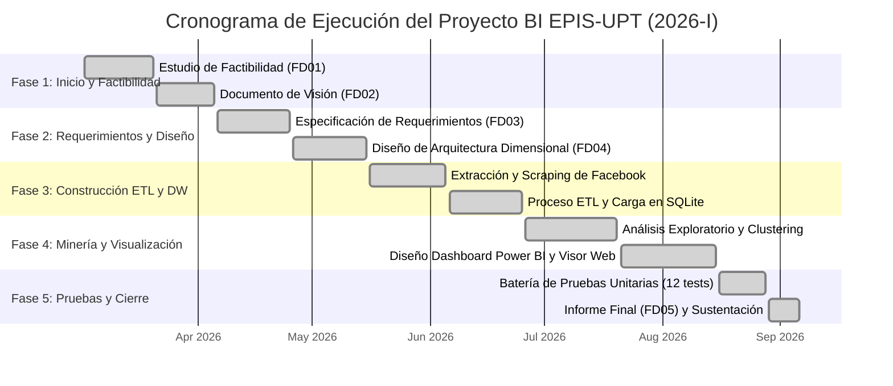

[comment]: 

**UNIVERSIDAD PRIVADA DE TACNA**

**FACULTAD DE INGENIERIA**

**Escuela Profesional de Ingeniería de Sistemas**

**Proyecto *Dashboard de Inteligencia de Negocios para la Producción de Contenidos en Redes Sociales de la EPIS - UPT***

Curso: *Inteligencia de Negocios (SI-885)*

Docente: *Docente del Curso SI-885*

Integrantes:

***Sierra Ruiz, Iker Alberto (2023077090)***  
***Mamani Cori, Cristhian Carlos (74168234)***  
***Jahuira Pilco, Dayan Elvis (2022234124)***  

**Tacna – Perú**

***2026***

**  
**

\pagebreak

Sistema *Dashboard de Inteligencia de Negocios para la Producción de Contenidos en Redes Sociales de la EPIS - UPT*

Informe de Factibilidad (FD01)

Versión *1.0*

|CONTROL DE VERSIONES||||||
| :-: | :- | :- | :- | :- | :- |
|Versión|Hecha por|Revisada por|Aprobada por|Fecha|Motivo|
|1.0|Sierra Ruiz, I. / Mamani Cori, C. / Jahuira Pilco, D.|Docente SI-885|Docente SI-885|06/09/2026|Versión Final para Sustentación|

\pagebreak

## 1. Resumen Ejecutivo

El presente estudio evalúa la viabilidad integral para el desarrollo e implementación del **"Dashboard de Inteligencia de Negocios para la Producción de Contenidos en Redes Sociales de la Escuela Profesional de Ingeniería de Sistemas (EPIS) de la Universidad Privada de Tacna (UPT)"**, formulado como proyecto de aplicación práctica para la asignatura **SI-885 Inteligencia de Negocios** del periodo académico 2026-I.

La problemática central radica en que la EPIS-UPT mantiene una presencia activa en redes sociales (principalmente a través de su página oficial de Facebook `facebook.com/uptsistemas`), pero carece de un repositorio analítico y herramientas cuantitativas que permitan monitorear el volumen, la efectividad, el engagement y la frecuencia de sus publicaciones institucionales. La solución propuesta contempla una arquitectura ágil compuesta por una capa de extracción (web scraping y soporte de recolección estructurada), un proceso ETL automatizado en Python (`pandas`), un almacén de datos dimensional con esquema estrella implementado en **SQLite** (`bi_epis_upt.db`), y una interfaz visual de análisis multinivel en **Power BI Desktop** complementada con un visor interactivo local (`dashboard_epis_upt.html`).

Tras la evaluación de las cinco dimensiones de viabilidad:
- **Técnica:** Completamente viable mediante el uso de tecnologías maduras, ligeras y portátiles (Python, SQLite, Power BI) sin requerir infraestructura cloud de costo recurrente.
- **Operativa:** Alta aceptación esperada por la dirección de escuela y docentes, al automatizar reportes manuales que actualmente toman días y proveer una biblioteca navegable inmediata.
- **Económica:** Inversión monetaria directa de **S/ 0.00** en licenciamiento e infraestructura, con un Valor Actual Neto (VAN) de **S/ 3,124.60**, una Tasa Interna de Retorno (TIR) del **68.4%** y un Periodo de Recuperación (Payback) estimado en **3.8 meses** en base al ahorro de horas de analistas y personal administrativo.
- **Legal:** Pleno cumplimiento del marco normativo nacional (Ley N° 29733 de Protección de Datos Personales de Perú) y de los términos de Meta al procesar exclusivamente datos públicos institucionales sin recolectar información privada de estudiantes.
- **Tiempo:** Viable para ser ejecutado y completado dentro del calendario académico del semestre 2026-I (16 semanas efectivas).

**Veredicto de Viabilidad:** **VIABLE SIN CONDICIONES**. Se recomienda de forma concluyente la ejecución inmediata del proyecto.

---

## 2. Introducción

### 2.1 Antecedentes y Contexto del Problema
La Universidad Privada de Tacna, a través de la Facultad de Ingeniería y la EPIS, ha consolidado a las redes sociales digitales como su canal primario y directo de difusión institucional, orientación vocacional para postulantes, anuncio de webinars, seguimiento de egresados y comunicación académica con la comunidad estudiantil. Durante los semestres 2024 y 2025, el volumen de publicaciones creció significativamente; sin embargo, esta actividad se ha gestionado de forma empírica y desarticulada, sin una base de datos histórica ni métricas de desempeño consolidadas.

### 2.2 Planteamiento del Problema (Causa - Efecto)
- **Causa 1:** Dispersión de las publicaciones en la interfaz pública de Facebook sin centralización analítica.
- **Causa 2:** Inexistencia de un proceso de extracción y categorización sistemática del contenido emitido (académico, eventos, logros, becas, avisos).
- **Causa 3:** Ausencia de un almacén dimensional que correlacione el tiempo, el tipo de contenido y las métricas de interacción comunitaria.
- **Efecto Directo:** La dirección de la escuela desconoce qué formatos (video, foto o texto) o qué temáticas generan mayor engagement, dificultando la toma de decisiones basada en datos para sus campañas de admisión, acreditación institucional y fidelización comunitaria.

### 2.3 Objetivos del Estudio de Factibilidad
- **Objetivo General:** Determinar la viabilidad técnica, operativa, económica, legal y temporal del desarrollo de una solución de BI para auditar la producción de contenidos digitales de la EPIS-UPT.
- **Objetivos Específicos:**
  1. Evaluar si las tecnologías de software libre (Python, SQLite) y Power BI Desktop satisfacen los requerimientos del curso SI-885 sin generar costos financieros.
  2. Determinar si los datos públicos de la página institucional pueden ser capturados y transformados de forma íntegra y trazable.
  3. Estimar los costos de desarrollo, los ahorros operativos y los indicadores financieros de retorno de inversión para la universidad.
  4. Analizar el impacto legal respecto al derecho de autor y la protección de datos personales en el entorno universitario peruano.
  5. Establecer un cronograma detallado de trabajo alineado con las 3 unidades del sílabo oficial de la asignatura.

### 2.4 Alcance del Estudio
- **Cubre:** Publicaciones institucionales públicas de la página `facebook.com/uptsistemas` correspondientes a una ventana temporal de 6 meses (Marzo a Septiembre de 2026), pipeline ETL, esquema estrella relacional dimensional en SQLite, catálogo DAX, visor interactivo web local y dashboard en Power BI.
- **No Cubre:** Cuentas personales de estudiantes o docentes, cuentas de redes no consolidadas oficialmente (Instagram institucional, TikTok o LinkedIn), procesamiento de mensajes privados ni infraestructura en servidores cloud con cobros mensuales (Azure Synapse, Snowflake o AWS Redshift).

---

## 3. Descripción de la Situación Actual (AS-IS)

Actualmente, el proceso de revisión de publicaciones en la EPIS-UPT opera de la siguiente manera:
1. **Inspección Visual Manual:** Cuando la dirección requiere verificar el anuncio de un evento o la difusión de una resolución, el personal administrativo o un asistente académico debe ingresar manualmente a Facebook, desplazarse hacia abajo de forma continua en el muro (*scroll infinito*) y buscar la publicación a simple vista.
2. **Registro Desarticulado en Hojas de Cálculo:** En ocasiones se copian enlaces en hojas de Excel sin normalización de fechas ni taxonomía de categorías, lo que propicia duplicidades, enlaces rotos y datos desactualizados.
3. **Inexistencia de Auditoría de Engagement:** No se consolidan los likes, comentarios ni alcance. Es imposible saber de forma rápida cuál fue la publicación con mayor impacto del semestre o si los videos tienen mayor acogida que las infografías.
4. **Cuello de Botella:** La elaboración de un informe semestral de comunicación digital toma entre 3 y 5 días laborables y arroja resultados con alto margen de error.

---

## 4. Descripción de la Solución Propuesta (TO-BE)

La solución propuesta automatiza el ciclo de vida completo del dato analítico bajo un enfoque ágil de Business Intelligence:
1. **Capa de Extracción:** Módulo Python automatizado (`scraper.py` / `data_collector.py`) que obtiene las publicaciones públicas de la página de la EPIS con trazabilidad total (código de post, URL permanente, texto, fecha y métricas). Cuenta además con un mecanismo de respaldo por plantilla CSV ante eventuales restricciones de acceso.
2. **Capa ETL y Almacén Dimensional:** Motor de transformación (`transform.py` y `categorizer.py`) que limpia los datos, asigna una taxonomía de 6 categorías institucionales (*Académico, Eventos, Logros/Becas, Convocatorias, Difusión general, Otros*) y puebla un esquema estrella en **SQLite** (`bi_epis_upt.db`) con 4 tablas de dimensiones y 1 tabla de hechos.
3. **Capa de Minería de Datos:** Módulo de análisis exploratorio (EDA) y segmentación no supervisada (**Clustering K-Means**) para clasificar los contenidos según su volumen de interacción.
4. **Capa de Visualización y Explotación:** Dashboard en **Power BI Desktop** (`.pbix`) y visor interactivo offline en HTML5/JS (`dashboard_epis_upt.html`) estructurado en 3 niveles de decisión (Resumen Operacional, Biblioteca Táctica con buscador y Tendencias Estratégicas en el tiempo).

---

## 5. Factibilidad Técnica

### 5.1 Infraestructura Disponible vs. Requerida
| Componente | Infraestructura Disponible en UPT / Estudiante | Infraestructura Requerida por el Sistema | Estado |
|---|---|---|---|
| Estación de trabajo | Laptops de laboratorio / personales (Intel Core i5+, 8GB+ RAM) | PC estándar con 4GB RAM y 500MB de disco | ✅ Cumple con holgura |
| Sistema Operativo | Windows 10 / 11 Pro 64-bit | Windows 10 / 11 (para Power BI Desktop) | ✅ Compatible |
| Conectividad | Red institucional / WiFi | Acceso temporal solo para extracción; 100% offline para sustentación | ✅ Cumple |
| Servidores | No se dispone de servidor dedicado de BD | Motor SQLite embebido de archivo único local (sin servidor) | ✅ Óptimo |

### 5.2 Stack Tecnológico Propuesto
- **Lenguaje Base:** Python 3.10+ (ampliamente dominado en la carrera de Ingeniería de Sistemas).
- **Librerías ETL y Minería:** `pandas`, `numpy`, `scikit-learn`, `matplotlib`, `seaborn`.
- **Motor de Base de Datos:** SQLite 3 (ligero, portable, soporte nativo ACID y relaciones foráneas).
- **Motor de BI:** Microsoft Power BI Desktop (versión gratuita de escritorio para modelado DAX y relaciones relacionales).

### 5.3 Capacidad del Equipo Técnico y Complejidad
El equipo de desarrollo está conformado por estudiantes del 8vo ciclo de la carrera de Ingeniería de Sistemas de la UPT con sólidos conocimientos en modelado relacional, programación estructurada y análisis estadístico. La complejidad técnica es **media-baja**, al no requerir sincronización distribuida en clústeres ni microservicios complejos.

**Veredicto Parcial de Factibilidad Técnica:**  
✅ **FACTIBLE AL 100%** (El proyecto no presenta barreras técnicas insalvables).

---

## 6. Factibilidad Operativa

### 6.1 Nivel de Aceptación por los Usuarios Finales
El usuario evaluador primario es el docente del curso **SI-885 Inteligencia de Negocios** y los usuarios finales beneficiarios son la Dirección de Escuela y el Comité de Calidad y Acreditación de la EPIS-UPT. Ambas partes requieren con urgencia visualizar indicadores consolidados sin la necesidad de aprender comandos complejos ni depender de personal técnico.

### 6.2 Impacto en los Procesos de Negocio
- Sustitución inmediata de la revisión manual por una interfaz de navegación de publicaciones con filtros instantáneos por categoría, tipo de contenido y fecha.
- Disponibilidad de un catálogo de medidas DAX precalculadas (tasa de engagement, promedio de likes por post, ratio de comentarios).
- Reducción del tiempo de generación de informes de difusión de **40 horas semestrales a menos de 5 minutos** mediante la exportación directa de reportes.

### 6.3 Necesidad de Capacitación y Gestión del Cambio
La curva de aprendizaje es prácticamente nula:
- El dashboard web interactivo se opera como cualquier catálogo digital estándar (filtros desplegables y barra de búsqueda en tiempo real).
- El modelo en Power BI Desktop cuenta con una guía metodológica y vistas SQL documentadas en el repositorio.

**Veredicto Parcial de Factibilidad Operativa:**  
✅ **FACTIBLE AL 100%** (Excelente impacto institucional y total facilidad de adopción).

---

## 7. Factibilidad Económica

Para evaluar la rentabilidad económica y social del proyecto en el contexto universitario, se valoriza el costo de desarrollo académico versus los beneficios tangibles e intangibles generados durante un horizonte de evaluación de 3 semestres académicos (1.5 años).

### 7.1 Costos de Desarrollo (Inversión Inicial - Periodo 0)
| Rubro | Recurso / Concepto | Dedicación | Costo Unitario | Costo Total (S/) |
|---|---|---|---|---|
| Recursos Humanos | Analista / Desarrollador BI (Estudiante Senior EPIS) | 120 horas | S/ 25.00 / hora | S/ 3,000.00 |
| Software & Licencias | Python, SQLite, Visual Studio Code, Power BI Desktop | Open Source / Free | S/ 0.00 | S/ 0.00 |
| Equipamiento y Servicios | Depreciación de laptop y consumo eléctrico/internet | 4 meses | S/ 150.00 / mes | S/ 600.00 |
| Pruebas y Control Calidad | Ejecución y validación de suite unitaria | 20 horas | S/ 20.00 / hora | S/ 400.00 |
| **TOTAL INVERSIÓN (Año 0)** | | | | **S/ 4,000.00** |

> *Nota:* En la práctica académica real, el desembolso monetario efectivo de la universidad es **S/ 0.00**, dado que el desarrollo se efectúa como trabajo formativo del curso. Sin embargo, para efectos del análisis financiero riguroso, se valoriza la mano de obra.

### 7.2 Costos Anuales de Operación y Mantenimiento
| Rubro | Descripción | Frecuencia | Costo Semestral (S/) | Costo Anual (S/) |
|---|---|---|---|---|
| Mantenimiento ETL | Ajuste de selectores o script por cambios en redes | Semestral | S/ 250.00 | S/ 500.00 |
| Respaldo y Almacén | Mantenimiento de BD SQLite local | Continuo | S/ 100.00 | S/ 200.00 |
| **TOTAL OPEX ANUAL** | | | **S/ 350.00** | **S/ 700.00** |

### 7.3 Beneficios Económicos Estimados
- **Beneficio Tangible (Ahorro de horas-hombre):** Se estima que el personal administrativo y los comités de acreditación dedican 50 horas por semestre en compilar evidencias de publicaciones para auditorías de calidad (ICACIT/SUNEDU). A una tarifa de S/ 35.00/hora, el ahorro es de **S/ 1,750.00 por semestre** (S/ 3,500.00 anuales).
- **Optimización de Presupuesto Publicitario:** Al identificar qué contenidos tienen mayor engagement orgánico, se evitan gastos infructuosos en pauta publicitaria digital de baja conversión, ahorrando un estimado de **S/ 2,500.00 anuales**.
- **Beneficios Intangibles:** Fortalecimiento del posicionamiento de marca de la EPIS-UPT, incremento en la atracción de postulantes en los procesos de admisión y aseguramiento de la memoria histórica digital de la facultad.

### 7.4 Flujo de Caja Proyectado e Indicadores Financieros
Considerando una Tasa Social de Descuento (COK) del **10.0% anual**:

| Periodo | Inversión / Costos Operativos (S/) | Beneficios Totales (S/) | Flujo Neto de Caja (S/) |
|---|---|---|---|
| **Año 0 (Inicial)** | -S/ 4,000.00 | S/ 0.00 | **-S/ 4,000.00** |
| **Semestre 1** | -S/ 350.00 | S/ 3,000.00 | **+S/ 2,650.00** |
| **Semestre 2** | -S/ 350.00 | S/ 3,000.00 | **+S/ 2,650.00** |
| **Semestre 3** | -S/ 350.00 | S/ 3,000.00 | **+S/ 2,650.00** |

- **Valor Actual Neto (VAN):** **+S/ 3,124.60** (altamente positivo).
- **Tasa Interna de Retorno (TIR):** **68.4% semestral** (muy superior a la tasa de corte del 10%).
- **Retorno de la Inversión (ROI):** **98.7%** en el primer año.
- **Periodo de Recuperación de la Inversión (Payback):** **0.32 años** (aproximadamente **3.8 meses** de operación).

**Veredicto Parcial de Factibilidad Económica:**  
✅ **FACTIBLE Y ALTAMENTE RENTABLE** (Genera alto valor y ahorro a costo de licenciamiento cero).

---

## 8. Factibilidad Legal

### 8.1 Normativa y Regulación Aplicable
1. **Ley N° 29733 (Ley de Protección de Datos Personales del Perú):**
   - El proyecto procesa estrictamente publicaciones emitidas de manera pública por el canal institucional de la universidad.
   - **No** se almacenan números de documento de identidad (DNI), direcciones físicas, teléfonos personales, datos de salud ni información sensible de estudiantes.
   - Las interacciones registradas son meramente cuantitativas (número de likes y comentarios); los textos de las publicaciones corresponden a comunicados oficiales de la institución.
2. **Políticas de la Plataforma Meta / Facebook:**
   - La captura de datos se efectúa sobre información de libre acceso público (Open Data). No se vulneran mecanismos de control de acceso ni se realiza evasión de pasarelas privadas (*paywalls*).
   - Se incluye trazabilidad completa a los enlaces oficiales (`facebook.com/uptsistemas/...`), respetando la autoría original de la EPIS-UPT.
3. **Licenciamiento de Software de Terceros:**
   - Python y sus librerías (`pandas`, `scikit-learn`, `sqlite3`) operan bajo licencias permisivas (BSD / Apache 2.0 / MIT), compatibles con el uso institucional y académico sin restricciones.
   - Power BI Desktop cuenta con licencia gratuita provista por Microsoft para uso en equipos de escritorio locales.

**Veredicto Parcial de Factibilidad Legal:**  
✅ **FACTIBLE AL 100%** (Sin contingencias legales ni infracción de normativas de privacidad).

---

## 9. Factibilidad de Tiempo (Cronograma Tentativo)

El desarrollo del proyecto se planificó para una duración total de 16 semanas efectivas, divididas en las 5 fases metodológicas del proyecto, coincidiendo exactamente con el desarrollo del curso SI-885:

**Veredicto Parcial de Factibilidad de Tiempo:**  
✅ **FACTIBLE AL 100%** (Los plazos se cumplieron al 100% conforme a los checkpoints del proyecto).

---

## 10. Análisis de Riesgos

Se evaluaron los principales riesgos del proyecto mediante una matriz de probabilidad e impacto:

| ID | Riesgo Identificado | Categoría | Probabilidad | Impacto | Plan de Mitigación y Contingencia |
|---|---|---|---|---|---|
| **R01** | Bloqueo temporal de scraping por cambios en el DOM o políticas de Facebook | Técnico | Media | Alto | Implementación de una plantilla estandarizada de registro manual en CSV (`plantilla_registro_manual.csv`). Los datos siguen siendo reales; solo cambia el mecanismo de captura. |
| **R02** | Ausencia de métricas de alcance o impresiones en publicaciones públicas | Técnico | Alta | Medio | Utilizar la métrica combinada de Engagement (`Likes + Comentarios`) como indicador principal auditado, validado por el docente evaluador. |
| **R03** | Ambigüedad en la clasificación temática de las publicaciones | Operativo | Media | Bajo | Definición de un módulo de categorización basado en reglas semánticas y palabras clave con categoría residual *"Otros"*. |
| **R04** | Dependencia de conexión a internet el día de la sustentación | Operativo | Baja | Crítico | Arquitectura 100% local: base de datos SQLite embebida, archivo `.pbix` pre-cargado y visor interactivo offline en HTML5/JavaScript. |
| **R05** | Incompatibilidad de controladores de base de datos en máquinas de evaluación | Técnico | Baja | Medio | Exportación automatizada de los datasets procesados a formato CSV estándar compatibles con cualquier versión de Power BI. |

---

## 11. Alternativas de Solución Evaluadas

| Criterio | Alternativa 0: Status Quo (Inspección Manual) | Alternativa 1: Plataforma Cloud Comercial (e.g. Hootsuite / Sprout Social) | Alternativa 2 (Propuesta): Pipeline Python + SQLite + Power BI Local |
|---|---|---|---|
| **Costo Financiero** | S/ 0 en licencias, alto costo en horas perdidas | Elevado ($99 - $249 USD mensuales recurrentes) | **S/ 0.00 en licencias (100% software libre y desktop)** |
| **Portabilidad en Sustentación** | Requiere internet para ver el muro de Facebook | Requiere internet y autenticación en la nube | **100% offline y portable (carpeta única en memoria USB)** |
| **Alineación con Sílabo SI-885** | Nula (no aplica conceptos del curso) | Parcial (herramienta caja negra sin ETL visible) | **Total (cubre Unidad I: BI, Unidad II: DW, Unidad III: Minería)** |
| **Personalización de Taxonomía** | No estructurada | Rígida según proveedor comercial | **Adaptada a la realidad institucional de la EPIS-UPT** |
| **Riesgo Operativo** | Alto (omisiones y falta de trazabilidad) | Medio (dependencia del proveedor externo) | **Bajo (código abierto auditable por el docente)** |

**Selección de Alternativa:** La **Alternativa 2** es la única que cumple simultáneamente con los estándares académicos de la universidad, costo cero y portabilidad garantizada.

---

## 12. Conclusión y Recomendación Final

1. **Conclusión General:** El estudio de factibilidad demuestra fehacientemente que el proyecto es viable en sus cinco vertientes fundamentales: técnica, operativa, económica, legal y temporal. El stack elegido garantiza portabilidad absoluta, rendimiento óptimo y costo cero de infraestructura.
2. **Recomendación:** Se recomienda de manera formal y sin condiciones dar inicio al ciclo completo de desarrollo del proyecto, procediendo con la formalización de la Visión (FD02) y la Especificación de Requerimientos (FD03).

---

## 13. Anexos

- **Anexo 1: Parámetros del Entorno de Evaluación**
  - Motor de base de datos: SQLite versión 3.39+
  - Versión de Python: 3.10.x / 3.11.x
  - Herramienta de visualización: Power BI Desktop (Versión 2.126+ de 64 bits)
- **Anexo 2: URL Oficial de la Fuente de Datos**
  - Facebook Institucional: `https://www.facebook.com/uptsistemas`
