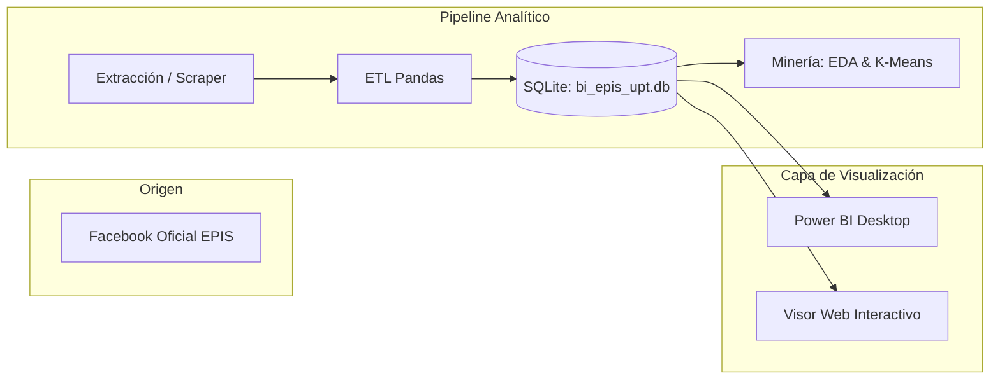

[comment]: 

**UNIVERSIDAD PRIVADA DE TACNA**

**FACULTAD DE INGENIERIA**

**Escuela Profesional de Ingeniería de Sistemas**

**Proyecto *Dashboard de Inteligencia de Negocios para la Producción de Contenidos en Redes Sociales de la EPIS - UPT***

Curso: *Inteligencia de Negocios (SI-885)*

Docente: *Docente del Curso SI-885*

Integrantes:

***Sierra Ruiz, Iker Alberto (2023077090)***  
***Mamani Cori, Cristhian Carlos (74168234)***  
***Jahuira Pilco, Dayan Elvis (2022234124)***  

**Tacna – Perú**

***2026***

**  
**

\pagebreak

Sistema *Dashboard de Inteligencia de Negocios para la Producción de Contenidos en Redes Sociales de la EPIS - UPT*

Documento de Visión (FD02)

Versión *1.0*

|CONTROL DE VERSIONES||||||
| :-: | :- | :- | :- | :- | :- |
|Versión|Hecha por|Revisada por|Aprobada por|Fecha|Motivo|
|1.0|Sierra Ruiz, I. / Mamani Cori, C. / Jahuira Pilco, D.|Docente SI-885|Docente SI-885|06/09/2026|Versión Final para Sustentación|

\pagebreak

## 1. Introducción

### 1.1 Propósito
El propósito del presente Documento de Visión es definir a alto nivel las necesidades de negocio, el alcance, los objetivos estratégicos, los perfiles de usuario y las características funcionales que guían la construcción del **Dashboard de Inteligencia de Negocios para la Producción de Contenidos en Redes Sociales de la EPIS-UPT**. Este documento establece una comprensión común y consensuada entre los desarrolladores, los docentes evaluadores y los directivos académicos de la institución.

### 1.2 Alcance del Producto
El sistema a desarrollar es un artefacto analítico y visual de Inteligencia de Negocios enfocado en procesar, transformar, modelar y presentar las publicaciones de la página de Facebook oficial de la Escuela Profesional de Ingeniería de Sistemas de la UPT (`facebook.com/uptsistemas`). El producto contempla una ventana de captura de 6 meses (Marzo a Septiembre de 2026), un esquema dimensional en estrella en SQLite, un pipeline de datos en Python y paneles de explotación analítica en Power BI Desktop y en un visor web local autónomo.

### 1.3 Definiciones, Siglas y Abreviaturas
- **BI (Business Intelligence):** Conjunto de metodologías, aplicaciones y tecnologías que permiten reunir, depurar y transformar datos en información estructurada para su explotación directa o para análisis.
- **DW (Data Warehouse):** Almacén de datos estructurado bajo técnicas de modelado dimensional (Kimball) para soportar consultas analíticas complejas.
- **ETL (Extract, Transform, Load):** Proceso de tres fases para extraer datos crudos, aplicar normalización y reglas de categorización, y cargar el resultado en el almacén de datos.
- **Engagement:** Métrica compuesta que cuantifica el grado de involucramiento e interacción comunitaria orgánica en una publicación (calculado formalmente como la suma de *Likes + Comentarios*).
- **KPI (Key Performance Indicator):** Indicador clave de rendimiento utilizado para medir el éxito de una acción o estrategia de difusión.
- **EPIS:** Escuela Profesional de Ingeniería de Sistemas.
- **UPT:** Universidad Privada de Tacna.

### 1.4 Referencias
- Sílabo del curso **SI-885 Inteligencia de Negocios (2026-I)**, Facultad de Ingeniería, Universidad Privada de Tacna.
- Documento de Factibilidad del Proyecto: `FD01_Factibilidad_EPIS_UPT.md`.
- Especificación de Requerimientos del Sistema: `FD03_Requerimientos_EPIS_UPT.md`.
- Kimball, R. & Ross, M. (2013). *The Data Warehouse Toolkit: The Definitive Guide to Dimensional Modeling*.

### 1.5 Resumen del Documento
El documento aborda el posicionamiento estratégico del producto dentro del ámbito universitario, describe los roles de los interesados, delimita las capacidades analíticas que proveerá el sistema, define la priorización de características bajo el enfoque MoSCoW y enumera las restricciones técnicas que garantizan su portabilidad y funcionamiento fuera de línea.

---

## 2. Posicionamiento

### 2.1 Oportunidad de Negocio
Las redes sociales constituyen el escaparate primario de la EPIS-UPT frente a la sociedad tacneña y la comunidad académica nacional e internacional. A través de ellas se publicitan acreditaciones, ceremonias de graduación, torneos de programación, congresos (como INFONOR) y convocatorias de admisión. No obstante, no existe un mecanismo formal para auditar el desempeño de dicha inversión comunicacional. Desarrollar una solución de BI propia permite a la facultad diagnosticar con precisión qué formatos audiovisuales rinden mejor, qué temáticas conectan con los estudiantes y optimizar el calendario de publicaciones semestrales con base en evidencia empírica.

### 2.2 Sentencia que Define el Problema

> El problema de **la dispersión y falta de analítica centralizada sobre la producción de contenidos en redes sociales** afecta a **la Dirección de Escuela, el Comité de Calidad/Acreditación y los docentes evaluadores de la EPIS - UPT**.  
> El impacto de esto es **la incapacidad de medir el engagement real, el desconocimiento de las categorías con mayor resonancia y el elevado consumo de tiempo (días de trabajo manual) para auditar evidencias de comunicación institucional**.  
> Una solución exitosa debería **centralizar las publicaciones de los últimos 6 meses en un almacén dimensional portátil, clasificar automáticamente las publicaciones por temáticas y ofrecer un dashboard multinivel que visualice KPIs, tendencias temporales y una biblioteca interactiva de publicaciones con filtros dinámicos**.

### 2.3 Sentencia de Posición del Producto

> Para **la Dirección de la EPIS-UPT y el docente de la cátedra de Inteligencia de Negocios** que **necesitan auditar, clasificar y visualizar el impacto de la comunicación institucional digital**, el **Dashboard de BI para Redes Sociales EPIS-UPT** es un **sistema de soporte a la decisión (DSS) y repositorio analítico dimensional** que **transforma publicaciones de Facebook en indicadores cuantitativos y visuales mediante un modelo estrella en SQLite y tableros interactivos**.  
> A diferencia de **la inspección manual directa en el muro de Facebook o el uso de plataformas cloud comerciales de alto costo**, nuestro producto **es 100% portable y autónomo (funciona sin conexión a internet en la sustentación), tiene costo financiero cero y aplica estrictamente los principios de modelado dimensional y minería de datos del sílabo oficial**.

---

## 3. Descripción de Interesados y Usuarios

### 3.1 Resumen de Interesados (Stakeholders)
| Nombre / Rol | Descripción | Responsabilidades en el Proyecto |
|---|---|---|
| **Director de Escuela (EPIS-UPT)** | Máxima autoridad académica de la carrera | Patrocinador institucional; beneficiario de los reportes estratégicos para toma de decisiones en difusión y acreditación. |
| **Docente de SI-885** | Catedrático evaluador de la asignatura | Validador metodológico del ciclo de vida del proyecto de BI (Unidades I, II y III). |
| **Comité de Calidad / Acreditación** | Equipo responsable de evidencias ICACIT/SINEACE | Beneficiario indirecto; utiliza los datos consolidados como evidencia de difusión a grupos de interés. |
| **Estudiante / Desarrollador BI** | Autor del proyecto | Responsable del levantamiento, extracción, modelado dimensional, pruebas y sustentación. |

### 3.2 Resumen de Usuarios
| Tipo de Usuario | Descripción | Frecuencia de Uso |
|---|---|---|
| **Analista de BI / Docente Evaluador** | Usuario primario que interactúa con el dashboard, aplica filtros, evalúa medidas DAX y analiza los clusters de engagement. | Semanal durante la evaluación / Bajo demanda en sustentación. |
| **Personal Directivo / Administrativo** | Usuario consultor que revisa los KPIs operacionales de las publicaciones y consulta la biblioteca para encontrar comunicados específicos. | Mensual o semestral (al cierre de periodos académicos). |

### 3.3 Entorno de Usuario
El sistema se ejecutará en computadoras personales o laptops de los laboratorios de la Facultad de Ingeniería de la UPT. Los entornos principales son:
- **Power BI Desktop:** Ejecutado en Windows para análisis multidimensional con filtros cruzados.
- **Navegador Web Local (Chrome, Edge, Firefox):** Para el visor `dashboard_epis_upt.html`, permitiendo interacción fluida mediante JavaScript y estilos CSS institucionales sin necesidad de tener Power BI instalado.

### 3.4 Perfiles Detallados de los Interesados
- **Director de EPIS-UPT:**
  - *Interés:* Maximizar el prestigio de la carrera, elevar el número de postulantes en ferias vocacionales y validar que los logros estudiantiles (Hackathons, convenios) se comuniquen masivamente.
  - *Criterio de éxito:* Disponer de un reporte semestral consolidado en PDF con métricas clave de engagement y recomendaciones editoriales accionables.
- **Docente de la Asignatura (SI-885):**
  - *Interés:* Comprobar que el estudiante domina los 3 pilares del curso: diseño de dashboards para toma de decisiones, arquitectura de almacenamiento dimensional (Kimball) y explotación/minería de datos.
  - *Criterio de éxito:* Que el pipeline corra limpiamente, que el esquema relacional en SQLite no viole integridad referencial y que el dashboard responda interactivamente de forma offline.

### 3.5 Necesidades de Interesados y Usuarios
| Necesidad | Prioridad | Preocupaciones Principales | Solución Propuesta |
|---|---|---|---|
| Centralización de publicaciones históricas | Alta | Dispersión de publicaciones y enlaces rotos | Almacenamiento unificado en SQLite con enlace permanente a cada post original. |
| Categorización temática de los contenidos | Alta | Ambigüedad al determinar qué tipo de post es | Módulo ETL con categorizador por reglas en 6 categorías predefinidas. |
| Consulta ágil tipo "biblioteca navegable" | Alta | Tardanza en encontrar posts específicos | Tabla con buscador de texto libre y filtros sincronizados por fecha y categoría. |
| Identificación de publicaciones más virales | Media | No se sabe qué formatos logran mayor interacción | Gráficos de ranking, medidas DAX de promedios y segmentación K-Means. |
| Funcionamiento sin internet en el aula de sustentación | Crítica | Caída de conexión durante la demo académica | Base de datos SQLite embebida y visor interactivo offline 100% autónomo. |

---

## 4. Vista General del Producto

### 4.1 Perspectiva del Producto
El Dashboard de BI es un sistema analítico independiente y autónomo (*standalone*). Se sitúa como una solución analítica desacoplada de la plataforma operativa de Facebook: no modifica los datos en la red social, sino que ingesta una copia estructurada hacia un almacén de datos dimensional local para consulta y soporte de decisiones.

### 4.2 Resumen de Capacidades
| Capacidad del Sistema | Beneficio Concreto para el Usuario |
|---|---|
| Extracción trazable de publicaciones | Garantiza que cada indicador visual provenga de un post real y auditable con su URL correspondiente. |
| Modelo Dimensional en Estrella | Agiliza los tiempos de respuesta y permite consultas analíticas cruzando tiempo, categorías y formatos. |
| Tableros con 3 niveles de decisión | Proporciona vistas adaptadas a cada necesidad: Operacional (KPIs diarios), Táctica (Buscador biblioteca) y Estratégica (Tendencias). |
| Medidas DAX estandarizadas | Homogeniza el cálculo de métricas (Engagement total, Likes promedio por post, % de participación). |
| Exportación de reportes | Facilita la incorporación directa de gráficos y tablas a los informes de gestión y acreditación en PDF. |

### 4.3 Suposiciones y Dependencias
1. La página de Facebook `facebook.com/uptsistemas` mantiene su visibilidad en modo público.
2. El entorno del usuario cuenta con Python 3.10+ y/o un navegador web moderno para ejecutar los artefactos.
3. Para la visualización del archivo `.pbix` se requiere Power BI Desktop instalado en un sistema operativo Windows.

### 4.4 Costos y Precios
Conforme al estudio de factibilidad FD01, el costo de licenciamiento e infraestructura del software es **S/ 0.00**. El producto es de distribución gratuita para fines institucionales y académicos en la UPT.

---

## 5. Características del Producto (Features)

| ID | Característica (Feature) | Descripción | Beneficio para el Usuario |
|---|---|---|---|
| **FT-01** | Ingesta Multifuente de Publicaciones | Captura automatizada mediante scraping con respaldo por plantilla estructurada en CSV. | Elimina la pérdida de datos y permite capturar 100% de los posts del semestre. |
| **FT-02** | Categorización Semántica Institucional | Clasificación automática de textos en 6 categorías temáticas oficiales de la facultad. | Permite segmentar el análisis por áreas de interés (académico, logros, eventos). |
| **FT-03** | Almacén Dimensional Esquema Estrella | Estructuración relacional en 4 dimensiones (`tiempo`, `categoria`, `tipo_contenido`, `red_social`) y 1 tabla de hechos. | Soporta agregaciones y análisis multidimensional eficiente con integridad referencial. |
| **FT-04** | Tarjetas de Indicadores Clave (KPIs) | Visualización destacada de métricas globales: Total Posts, Total Likes, Total Comentarios, Total Engagement. | Diagnóstico inmediato del estado de la producción de contenidos en un solo vistazo. |
| **FT-05** | Biblioteca Interactiva con Buscador | Vista tabular tipo catálogo con barra de búsqueda de texto libre y filtros cruzados. | Localización de publicaciones en menos de 2 segundos sin navegar el muro de Facebook. |
| **FT-06** | Análisis de Tendencias Temporales | Gráficos de líneas y barras apiladas mostrando la evolución de publicaciones y engagement mes a mes. | Descubrimiento de patrones de estacionalidad y picos de difusión académica. |
| **FT-07** | Segmentación no Supervisada (Clustering) | Modelo K-Means en Python (`scikit-learn`) que agrupa publicaciones por nivel de impacto (Alto, Medio, Bajo). | Identificación automatizada de contenidos de alta efectividad comunicacional. |

---

## 6. Restricciones

1. **Restricción de Privacidad:** Solo se recolectan y analizan publicaciones de la cuenta oficial de la facultad. Queda estrictamente restringido recolectar nombres, perfiles privados o comentarios de estudiantes individuales.
2. **Restricción de Red Social:** El alcance del MVP se limita exclusivamente a Facebook como la red primaria oficial de la EPIS-UPT. Instagram y TikTok quedan diferidos para versiones posteriores.
3. **Restricción de Infraestructura:** El sistema debe operar 100% en modo local (*on-premises* / portable) en una unidad física de almacenamiento sin depender de servicios en la nube de pago ni conexión constante a internet.
4. **Restricción Metodológica:** La arquitectura dimensional debe adherirse rigurosamente a las directrices de Ralph Kimball y a los lineamientos del sílabo SI-885.

---

## 7. Rangos de Calidad

- **Rendimiento:** Tiempos de respuesta inferiores a 1 segundo para el filtrado multidimensional sobre el volumen del semestre (27 a 500 registros).
- **Usabilidad:** Interfaz limpia basada en la paleta institucional de la UPT (azul institucional `#1a365d`, cian institucional `#2b6cb0` y acentos limpios) con tipografía estándar Segoe UI.
- **Confiabilidad:** 0 violaciones de llaves foráneas (`PRAGMA foreign_key_check` con resultado limpio) y 100% de trazabilidad entre cada registro y su enlace original de publicación.
- **Portabilidad:** La base de datos (`bi_epis_upt.db`) y el visor interactivo (`dashboard_epis_upt.html`) pueden transferirse en una memoria USB y ejecutarse en cualquier computadora moderna sin instalación previa de servidores.

---

## 8. Precedencia y Priorización (Método MoSCoW)

### Must Have (Obligatorio para el MVP)
- Extracción de publicaciones de los últimos 6 meses de `facebook.com/uptsistemas`.
- Módulo ETL de limpieza y categorización en 6 temáticas institucionales.
- Base de datos SQLite con esquema estrella (`dim_tiempo`, `dim_categoria`, `dim_tipo_contenido`, `dim_red_social`, `hecho_publicacion`).
- Dashboard con 3 pestañas funcionales (Resumen Operacional, Biblioteca Táctica, Tendencias Estratégicas).
- Portabilidad local para sustentación presencial.

### Should Have (Altamente deseable)
- Segmentación por Clustering K-Means sobre variables de interacción.
- Visor interactivo autónomo en HTML5/JS para demostración inmediata sin requerir Power BI abierto.
- Catálogo de medidas DAX formalizado para importación directa.

### Could Have (Opcional / Valor Agregado)
- Gráfico de dispersión de engagement vs. longitud de texto del post.
- Exportación directa a formatos PDF y CSV desde la interfaz del visor interactivo.

### Won't Have (Fuera de alcance en esta versión)
- Soporte para Instagram u otras redes sociales institucionales.
- Autenticación con múltiples roles o usuarios simultáneos.
- Pipeline de streaming en tiempo real (las publicaciones se actualizan por lotes semestrales).

---

## 9. Otros Requerimientos del Producto

- **Estándares Aplicables:** Estándar de modelado Kimball para almacenes de datos y directrices PEP-8 para el código fuente Python.
- **Requerimientos de Sistema:**
  - Hardware: Procesador Intel Core i3 / AMD Ryzen 3 o superior, 4 GB de memoria RAM, 300 MB de espacio libre en disco.
  - Software: Microsoft Windows 10/11 (para Power BI Desktop) o cualquier SO compatible con navegadores web y Python (Linux/macOS para ETL y visor HTML).
- **Requerimientos de Documentación:** Manual técnico de arquitectura (FD04), especificación de requerimientos (FD03), informe final consolidado (FD05) y guía de sustentación rápida.

---

## 10. Apéndices / Glosario

- **Kimball Methodology:** Enfoque de abajo hacia arriba (*bottom-up*) para el diseño de almacenes de datos centrado en procesos de negocio representados en tablas de hechos y dimensiones.
- **Esquema Estrella (Star Schema):** Estructura relacional donde una tabla central de hechos se conecta directamente a múltiples dimensiones mediante llaves foráneas.
- **DAX (Data Analysis Expressions):** Lenguaje de fórmulas y expresiones analíticas utilizado en Microsoft Power BI, Analysis Services y Power Pivot en Excel.
- **Clustering K-Means:** Algoritmo de aprendizaje automático no supervisado que particiona un conjunto de $n$ observaciones en $k$ grupos homogéneos en función de la similitud entre sus características vectoriales.
