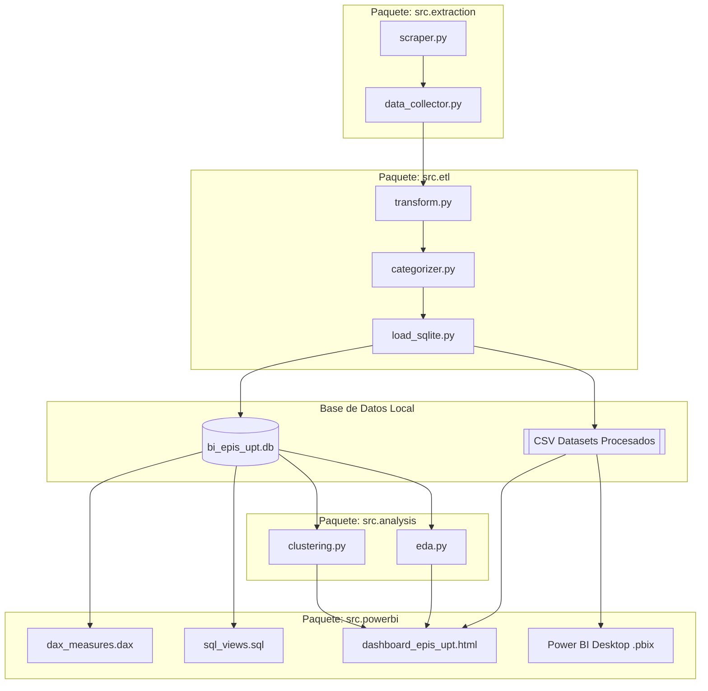
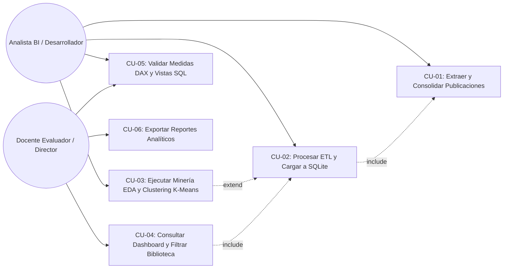
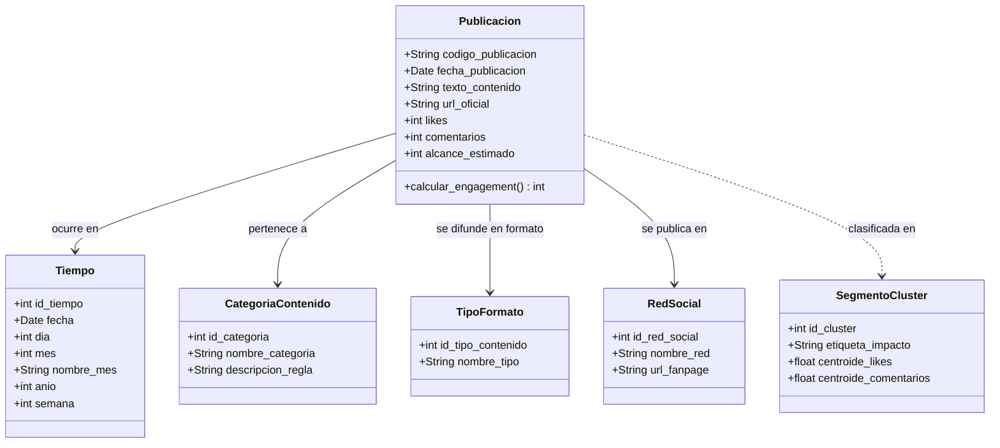

[comment]: 

**UNIVERSIDAD PRIVADA DE TACNA**

**FACULTAD DE INGENIERIA**

**Escuela Profesional de Ingeniería de Sistemas**

**Proyecto *Dashboard de Inteligencia de Negocios para la Producción de Contenidos en Redes Sociales de la EPIS - UPT***

Curso: *Inteligencia de Negocios (SI-885)*

Docente: *Docente del Curso SI-885*

Integrantes:

***Sierra Ruiz, Iker Alberto (2023077090)***  
***Mamani Cori, Cristhian Carlos (74168234)***  
***Jahuira Pilco, Dayan Elvis (2022234124)***  

**Tacna – Perú**

***2026***

**  
**

\pagebreak

Sistema *Dashboard de Inteligencia de Negocios para la Producción de Contenidos en Redes Sociales de la EPIS - UPT*

Informe de Especificación de Requerimientos de Software (FD03)

Versión *1.0*

|CONTROL DE VERSIONES||||||
| :-: | :- | :- | :- | :- | :- |
|Versión|Hecha por|Revisada por|Aprobada por|Fecha|Motivo|
|1.0|Sierra Ruiz, I. / Mamani Cori, C. / Jahuira Pilco, D.|Docente SI-885|Docente SI-885|06/09/2026|Versión Final para Sustentación|

\pagebreak

## 1. Introducción

### 1.1 Propósito
El presente documento tiene como finalidad definir con precisión los requerimientos funcionales (RF) y no funcionales (RNF) del **Dashboard de Inteligencia de Negocios para la Producción de Contenidos en Redes Sociales de la EPIS-UPT**. Sirve de contrato técnico entre los interesados (docente, autoridades de la escuela y equipo de desarrollo), guiando la arquitectura, la implementación del pipeline ETL y la construcción de los tableros analíticos.

### 1.2 Alcance del Sistema
El sistema abarca la ingesta de publicaciones públicas de Facebook (`facebook.com/uptsistemas`), el procesamiento y categorización de datos mediante Python, la persistencia en un almacén de datos dimensional en SQLite (`bi_epis_upt.db`), la ejecución de análisis exploratorio y minería de datos (Unidad III), y la provisión de dashboards interactivos locales en Power BI y en tecnología web HTML5/JS.

### 1.3 Definiciones, Siglas y Abreviaturas
- **SRS:** Software Requirements Specification (Especificación de Requerimientos de Software).
- **RF:** Requerimiento Funcional.
- **RNF:** Requerimiento No Funcional.
- **CU:** Caso de Uso.
- **DW:** Data Warehouse (Almacén de Datos).
- **DAX:** Data Analysis Expressions (Lenguaje analítico de Power BI).
- **EDA:** Exploratory Data Analysis (Análisis Exploratorio de Datos).
- **PK / FK:** Primary Key (Llave Primaria) / Foreign Key (Llave Foránea).

### 1.4 Referencias
- `FD01_Factibilidad_EPIS_UPT.md` (Informe de Factibilidad).
- `FD02_Vision_EPIS_UPT.md` (Documento de Visión).
- Sílabo académico del curso **SI-885 Inteligencia de Negocios (2026-I)**, EPIS - UPT.

---

## 2. Descripción General del Sistema

### 2.1 Perspectiva del Producto
El sistema se posiciona como una plataforma analítica desacoplada (*read-only* analítico) orientada a la auditoría de contenidos digitales. No interactúa con las APIs transaccionales de escritura de Facebook, sino que procesa instantáneas de publicaciones públicas con fines estadísticos y de toma de decisiones institucionales.

### 2.2 Funciones Principales del Producto
1. **Extracción y Respaldo:** Capturar publicaciones institucionales públicas con sus atributos de fecha, texto descriptivo, formato y reacciones.
2. **Transformación y Enriquecimiento:** Normalizar fechas al estándar ISO-8601, limpiar cadenas de texto y clasificar temáticamente cada publicación en 6 categorías predefinidas.
3. **Modelamiento Dimensional:** Cargar los datos transformados en un esquema estrella relacional con integridad forzada.
4. **Minería y Segmentación:** Generar agrupamientos por clustering K-Means para clasificar el nivel de impacto de los contenidos.
5. **Visualización y Consulta Dinámica:** Brindar tableros con KPIs, gráficos de tendencia y una biblioteca con motor de búsqueda y filtros reactivos.

### 2.3 Características de los Usuarios
- **Docente Evaluador / Analista BI:** Usuario con conocimientos avanzados en analítica, bases de datos y estadística; evalúa la corrección técnica del modelo dimensional y la significancia de los datos presentados.
- **Directivos de EPIS-UPT:** Usuarios no técnicos que requieren consultar indicadores estratégicos en dashboards visuales intuitivos y claros.

### 2.4 Restricciones Generales
- Ejecución 100% autónoma y offline durante la presentación y sustentación.
- Los datos de origen deben ser estrictamente públicos, preservando la privacidad de las personas.
- Cero costo en licenciamiento de software o infraestructura de nube.

### 2.5 Suposiciones y Dependencias
- Se asume la disponibilidad local de Python 3.10+ para ejecutar el pipeline de datos y de Power BI Desktop para abrir el archivo `.pbix`.
- El visor web interactivo se apoya en navegadores modernos (Google Chrome, Microsoft Edge, Mozilla Firefox) sin necesidad de servidor HTTP dedicado.

---

## 3. Requerimientos Funcionales (RF)

| Código | Nombre | Descripción | Prioridad | Actor Relacionado |
|---|---|---|---|---|
| **RF-01** | Extracción de Publicaciones Públicas | El sistema debe recolectar las publicaciones públicas de la página de Facebook institucional (`facebook.com/uptsistemas`) correspondientes a una ventana de 6 meses, capturando fecha, texto, tipo de formato, likes y comentarios. | Alta | Analista BI / Script Scraper |
| **RF-02** | Soporte de Respaldo por Plantilla | El sistema debe permitir la carga alternativa de publicaciones mediante una plantilla estructurada en CSV (`plantilla_registro_manual.csv`) cuando existan restricciones temporales de acceso a la red social. | Alta | Analista BI |
| **RF-03** | Normalización y Limpieza de Datos | El sistema debe estandarizar fechas al formato `AAAA-MM-DD`, eliminar caracteres espurios, deduplicar registros mediante un código único de post y verificar la ausencia de valores nulos críticos. | Alta | Motor ETL |
| **RF-04** | Categorización Temática Automática | El sistema debe asignar automáticamente a cada post una de las 6 categorías oficiales (*Académico, Eventos, Logros/Becas, Convocatorias, Difusión general, Otros*) en base a un análisis de reglas y palabras clave institucionales. | Alta | Motor ETL / Categorizador |
| **RF-05** | Carga al Almacén Dimensional | El sistema debe persistir los datos procesados en la base de datos SQLite `bi_epis_upt.db`, poblando las 4 dimensiones (`dim_tiempo`, `dim_categoria`, `dim_tipo_contenido`, `dim_red_social`) y la tabla de hechos `hecho_publicacion`. | Alta | Motor ETL / SQLite Loader |
| **RF-06** | Cálculo de Medidas y KPIs (DAX) | El sistema debe proveer fórmulas calculadas para: Total Publicaciones, Total Likes, Total Comentarios, Total Alcance, Total Engagement, Promedio de Engagement por Post y % de Participación. | Alta | Analista BI / Power BI |
| **RF-07** | Biblioteca Interactiva con Buscador | El sistema debe proveer una vista tabular navegable con una barra de búsqueda de texto libre que filtre publicaciones en tiempo real según su contenido o palabras clave. | Alta | Usuario / Docente |
| **RF-08** | Filtrado Multidimensional Sincronizado | El sistema debe permitir filtrar todos los tableros de forma cruzada por: rango de fechas (mes/año), categoría de contenido, tipo de formato (foto/video/texto) y red social. | Alta | Usuario / Docente |
| **RF-09** | Análisis Exploratorio y Gráficos Estadísticos | El sistema debe generar gráficos de distribución de publicaciones, evolución temporal y participación de interacción en formato PNG de alta resolución. | Media | Analista BI |
| **RF-10** | Segmentación no Supervisada (K-Means) | El sistema debe ejecutar el algoritmo K-Means ($k=3$) sobre las variables de likes y comentarios, asignando a cada publicación una etiqueta de cluster (*Alto Impacto, Interacción Formativa, Avisos Básicos*). | Media | Analista BI / Módulo Minería |
| **RF-11** | Trazabilidad a la Fuente Original | El sistema debe mantener y mostrar el hipervínculo web permanente (`url_publicacion`) hacia la publicación oficial original en Facebook para cada registro analizado. | Alta | Usuario / Docente |
| **RF-12** | Exportación de Vistas Analíticas | El sistema debe permitir la exportación de los paneles y tablas del dashboard a formatos imprimibles como PDF o imagen para su inclusión en reportes de gestión. | Media | Usuario / Docente |

---

## 4. Requerimientos No Funcionales (RNF)

| Código | Categoría | Descripción | Métrica / Criterio de Aceptación |
|---|---|---|---|
| **RNF-01** | Rendimiento | El tiempo de respuesta al aplicar cualquier filtro multidimensional o búsqueda en el catálogo debe ser prácticamente instantáneo. | Tiempo de respuesta $\le 1.0$ segundo en consultas sobre el dataset. |
| **RNF-02** | Portabilidad | Toda la solución debe funcionar sin requerir servidores externos ni servicios en la nube, operando desde una carpeta local o unidad USB. | 100% funcional en modo offline en equipos Windows estándar. |
| **RNF-03** | Integridad de Datos | El almacén dimensional no debe admitir inconsistencias relacionales ni huérfanos entre hechos y dimensiones. | `PRAGMA foreign_key_check` en SQLite debe arrojar 0 violaciones. |
| **RNF-04** | Usabilidad | La interfaz de los tableros debe emplear la paleta de identidad de la UPT y presentar una jerarquía visual clara de 3 niveles de decisión. | Cumplimiento del diseño definido en `design.md` y legibilidad en pantallas de 1366x768 o superior. |
| **RNF-05** | Privacidad y Seguridad | El sistema no debe almacenar datos personales sensibles (DNI, nombres privados de alumnos, correos particulares). | 0 registros de información privada de identificación personal (PII). |
| **RNF-06** | Mantenibilidad | El código del pipeline debe estar modularizado en paquetes Python con separación estricta de responsabilidades (extracción, ETL, análisis, soporte BI). | Cobertura de pruebas unitarias automatizadas con resultado exitoso al 100%. |
| **RNF-07** | Confiabilidad de Ejecución | La suite completa del pipeline analítico debe poder ejecutarse de forma secuencial y desatendida mediante un único comando maestro. | `python run_pipeline.py` completa todas las fases sin errores en menos de 10 segundos. |

---

## 5. Diagrama de Paquetes

Organización lógica modular del sistema en capas desacopladas:

---

## 6. Actores del Sistema

| Actor | Descripción | Tipo |
|---|---|---|
| **Analista de BI / Desarrollador** | Ejecuta el pipeline de datos, supervisa el proceso ETL, calibra el algoritmo de clustering y valida las medidas DAX. | Primario |
| **Docente Evaluador (SI-885)** | Interroga los tableros analíticos durante la sustentación, evalúa la correspondencia con las 3 unidades del sílabo y valida la integridad de los datos. | Primario |
| **Director / Autoridad de EPIS-UPT** | Consulta los reportes estratégicos, el ranking de publicaciones y las recomendaciones editoriales para la toma de decisiones institucionales. | Secundario (Consumidor final) |

---

## 7. Diagrama de Casos de Uso

---

## 8. Especificación Detallada de Casos de Uso

### CU-01: Extraer y Consolidar Publicaciones de Facebook
- **Actor:** Analista de BI.
- **Precondiciones:** Disponibilidad de conexión a internet o existencia de datos de respaldo en `plantilla_registro_manual.csv`.
- **Flujo Normal:**
  1. El actor ejecuta el módulo de recolección (`data_collector.py`).
  2. El sistema valida la accesibilidad a la página oficial de Facebook de la EPIS-UPT.
  3. El sistema extrae las publicaciones correspondientes a los últimos 6 meses (Marzo a Septiembre de 2026).
  4. El sistema consolida los registros en `data/raw/publicaciones_raw.csv`.
  5. El sistema reporta el total de publicaciones recolectadas y la integridad de los campos.
- **Flujos Alternos:**
  - *A1: Bloqueo de conexión o restricción de scraper:* El sistema detecta la inaccesibilidad y carga automáticamente la información verificada desde la plantilla de respaldo manual, manteniendo la ejecución sin detener el flujo.
- **Postcondiciones:** Archivo `publicaciones_raw.csv` generado con 27 registros reales y atributos completos.

---

### CU-02: Procesar ETL y Cargar a Esquema Estrella SQLite
- **Actor:** Analista de BI / Sistema.
- **Precondiciones:** Archivo `publicaciones_raw.csv` generado y legible.
- **Flujo Normal:**
  1. El sistema invoca `transform.py` y `categorizer.py`.
  2. Se limpian y normalizan fechas al estándar ISO-8601 (`YYYY-MM-DD`).
  3. Se clasifican las publicaciones en las 6 categorías temáticas mediante reglas semánticas.
  4. Se generan y guardan los datasets procesados (`dim_tiempo.csv`, `dim_categoria.csv`, `dim_tipo_contenido.csv`, `dim_red_social.csv` y `hecho_publicacion.csv`).
  5. El cargador `load_sqlite.py` inicializa la base de datos `bi_epis_upt.db`, crea las tablas con llaves primarias/foráneas y ejecuta la inserción masiva.
  6. El sistema ejecuta una verificación de integridad referencial (`PRAGMA foreign_key_check`).
- **Flujos de Excepción:**
  - *E1: Registro con fecha inválida:* El registro es descartado o ajustado por inferencia de contexto, registrándose en el log.
- **Postcondiciones:** Base de datos relacional dimensional poblada sin huérfanos ni duplicados.

---

### CU-03: Ejecutar Minería EDA y Clustering K-Means
- **Actor:** Analista de BI.
- **Precondiciones:** Base de datos SQLite cargada con datos consolidados.
- **Flujo Normal:**
  1. El actor ejecuta los módulos `eda.py` y `clustering.py`.
  2. El sistema calcula estadísticas descriptivas (medias, cuartiles, correlaciones).
  3. Se exportan gráficos de distribución a la carpeta `data/processed/eda_charts/`.
  4. El algoritmo K-Means normaliza las variables de interacción y clasifica las publicaciones en 3 conglomerados.
  5. Se documentan los hallazgos en `hallazgos_eda.md` y se exporta `clustering_results.csv`.
- **Postcondiciones:** Gráficos estadísticos y dataset de clusters generados para visualización.

---

### CU-04: Consultar Dashboard y Filtrar Biblioteca Navegable
- **Actor:** Docente Evaluador / Director de Escuela.
- **Precondiciones:** Tablero abierto en Power BI Desktop (`.pbix`) o visor web interactivo (`dashboard_epis_upt.html`) cargado en el navegador.
- **Flujo Normal:**
  1. El usuario visualiza la pantalla principal con las 4 tarjetas de KPIs globales.
  2. El usuario selecciona un filtro (por ejemplo, categoría *"Eventos"* o formato *"Video"*).
  3. El sistema actualiza instantáneamente todos los gráficos y tablas del panel.
  4. El usuario accede a la pestaña *"Biblioteca"* e ingresa un término de búsqueda en la barra de texto libre (e.g., *"Hackathon"* o *"Graduación"*).
  5. El sistema filtra las filas de la tabla en tiempo real, mostrando únicamente las publicaciones coincidentes.
  6. El usuario hace clic en el enlace oficial para auditar la publicación en Facebook.
- **Postcondiciones:** Consulta y auditoría realizada en menos de 1 segundo de forma totalmente interactiva.

---

## 9. Matriz de Trazabilidad (Requerimientos Funcionales ↔ Casos de Uso)

| Requerimiento Funcional | CU-01: Extracción | CU-02: ETL & SQLite | CU-03: Minería EDA | CU-04: Consulta Dashboard | CU-05: Medidas DAX | CU-06: Exportación |
|---|:---:|:---:|:---:|:---:|:---:|:---:|
| **RF-01: Extracción Publicaciones** | ✔ | | | | | |
| **RF-02: Respaldo Plantilla CSV** | ✔ | | | | | |
| **RF-03: Normalización y Limpieza** | | ✔ | | | | |
| **RF-04: Categorización Semántica** | | ✔ | | | | |
| **RF-05: Carga Almacén SQLite** | | ✔ | | | | |
| **RF-06: Cálculo de Medidas DAX** | | | | ✔ | ✔ | |
| **RF-07: Biblioteca con Buscador** | | | | ✔ | | |
| **RF-08: Filtrado Multidimensional** | | | | ✔ | | |
| **RF-09: EDA y Gráficos Estadísticos**| | | ✔ | | | ✔ |
| **RF-10: Clustering K-Means** | | | ✔ | ✔ | | |
| **RF-11: Trazabilidad URL** | ✔ | ✔ | | ✔ | | |
| **RF-12: Exportación de Vistas** | | | | | | ✔ |

---

## 10. Reglas de Negocio

| Código | Nombre de la Regla | Descripción |
|---|---|---|
| **RN-01** | Dominio Institucional Oficial | Solo se admiten publicaciones emitidas por la página pública autorizada de la escuela (`facebook.com/uptsistemas`). Queda excluido contenido de perfiles personales de terceros. |
| **RN-02** | Taxonomía Cerrada de 6 Categorías | Cada publicación debe asignarse de forma unívoca a una de las siguientes categorías institucionales: `Académico`, `Eventos`, `Logros/Becas`, `Convocatorias`, `Difusión general` y `Otros`. En caso de duda o texto ambiguo, se asigna `Otros`. |
| **RN-03** | Trazabilidad Obligatoria | Toda publicación registrada en la tabla de hechos debe poseer un identificador institucional único (`codigo_publicacion`) y la URL permanente válida que conduzca al post en Facebook. |
| **RN-04** | Definición Aditiva de Engagement | La métrica de engagement se calcula formalmente como la adición aritmética simple de interacciones directas: $\text{Engagement} = \text{Likes} + \text{Comentarios}$. |
| **RN-05** | Integridad Temporal | Toda fecha debe pertenecer al periodo de evaluación (últimos 6 meses: Marzo a Septiembre de 2026) y registrarse con el formato estándar `AAAA-MM-DD`. |

---

## 11. Modelo de Dominio

Representación conceptual de las entidades y relaciones del proceso de análisis de redes sociales:

---

## 12. Anexos

- **Catálogo de Palabras Clave de Categorización (`categorizer.py`):**
  - *Académico:* "clases", "matrícula", "docente", "silabo", "curso", "horario", "sustentación", "tesis", "laboratorio".
  - *Eventos:* "ceremonia", "graduación", "aniversario", "semana", "congreso", "infonor", "torneo", "jornada".
  - *Logros/Becas:* "ganador", "premio", "felicitaciones", "beca", "reconocimiento", "hackathon", "primer puesto".
  - *Convocatorias:* "convocatoria", "postula", "admisión", "inscripción", "taller", "webinar", "voluntariado".
  - *Difusión general:* "saludo", "comunicado", "bienvenidos", "atención", "aviso".
  - *Otros:* Publicaciones residuales que no coincidan con los patrones anteriores.
