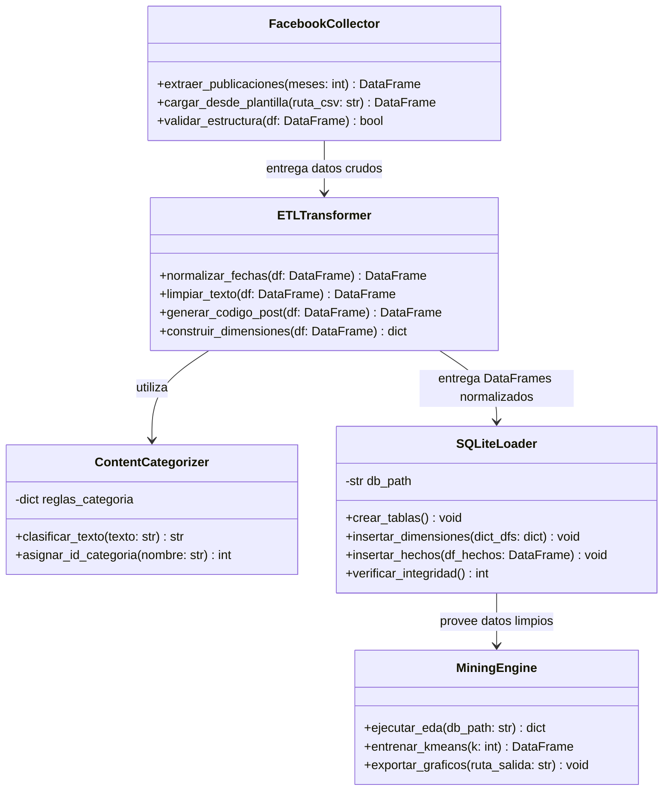
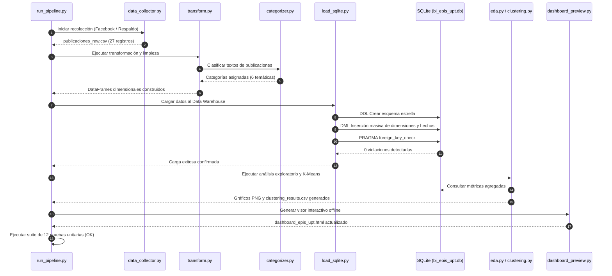
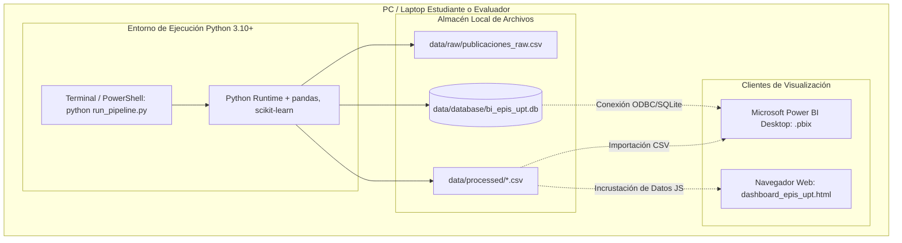
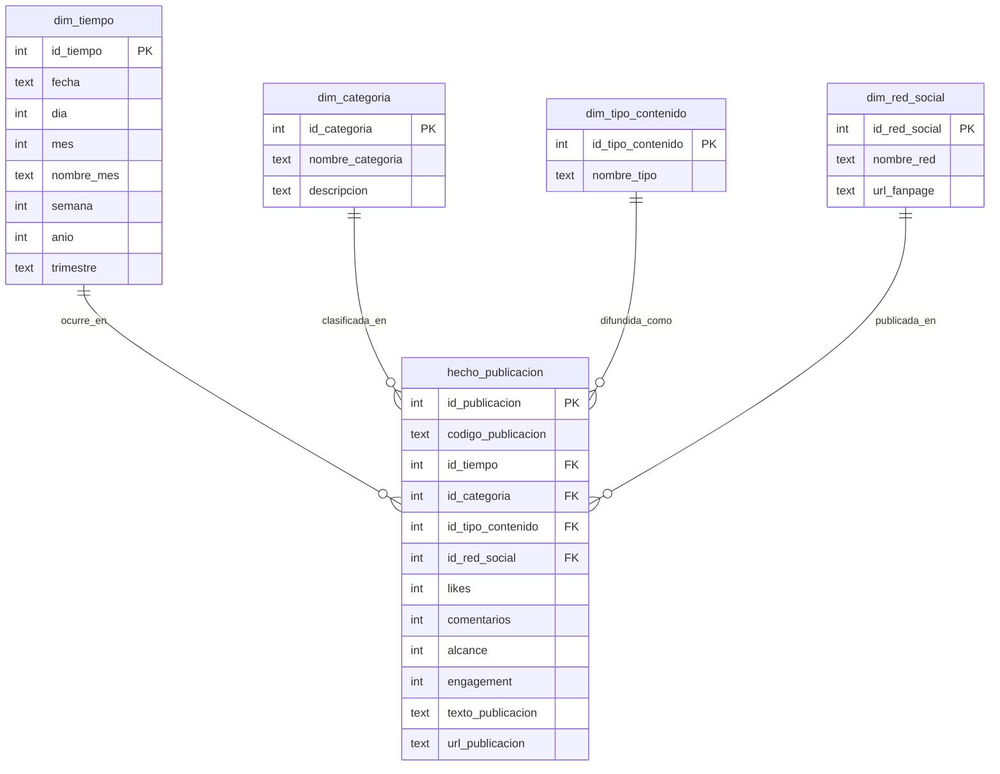

[comment]: 

**UNIVERSIDAD PRIVADA DE TACNA**

**FACULTAD DE INGENIERIA**

**Escuela Profesional de Ingeniería de Sistemas**

**Proyecto *Dashboard de Inteligencia de Negocios para la Producción de Contenidos en Redes Sociales de la EPIS - UPT***

Curso: *Inteligencia de Negocios (SI-885)*

Docente: *Docente del Curso SI-885*

Integrantes:

***Sierra Ruiz, Iker Alberto (2023077090)***  
***Mamani Cori, Cristhian Carlos (74168234)***  
***Jahuira Pilco, Dayan Elvis (2022234124)***  

**Tacna – Perú**

***2026***

**  
**

\pagebreak

Sistema *Dashboard de Inteligencia de Negocios para la Producción de Contenidos en Redes Sociales de la EPIS - UPT*

Informe de Arquitectura de Software (FD04)

Versión *1.0*

|CONTROL DE VERSIONES||||||
| :-: | :- | :- | :- | :- | :- |
|Versión|Hecha por|Revisada por|Aprobada por|Fecha|Motivo|
|1.0|Sierra Ruiz, I. / Mamani Cori, C. / Jahuira Pilco, D.|Docente SI-885|Docente SI-885|06/09/2026|Versión Final para Sustentación|

\pagebreak

## 1. Introducción

### 1.1 Propósito
El presente Documento de Arquitectura de Software (SAD) describe de forma integral y rigurosa la arquitectura del sistema **"Dashboard de Inteligencia de Negocios para la Producción de Contenidos en Redes Sociales de la EPIS - UPT"**. Proporciona una perspectiva arquitectónica completa utilizando el modelo de vistas 4+1 de Philippe Kruchten para capturar decisiones de diseño, estructuras de datos dimensionales, patrones arquitectónicos y el flujo de procesamiento de datos.

### 1.2 Alcance
Este documento cubre la arquitectura integral del sistema analítico: desde la capa de extracción e ingesta de publicaciones públicas de Facebook, el procesamiento ETL y persistencia relacional en SQLite (`bi_epis_upt.db`), hasta la capa de minería de datos (EDA y K-Means) y las plataformas de explotación analítica en Power BI Desktop y el visor interactivo offline en HTML5/JavaScript.

### 1.3 Definiciones, Siglas y Abreviaturas
- **SAD:** Software Architecture Document.
- **4+1 View Model:** Modelo de arquitectura basado en 5 vistas: Casos de Uso, Lógica, Procesos, Despliegue e Implementación.
- **Star Schema (Esquema Estrella):** Modelo relacional dimensional de Ralph Kimball donde una tabla de hechos central se vincula con tablas de dimensiones desnormalizadas.
- **ETL:** Extract, Transform, Load (Extracción, Transformación y Carga).
- **DAX:** Data Analysis Expressions.
- **Pipes and Filters:** Patrón arquitectónico de procesamiento secuencial de datos mediante transformadores desacoplados.

### 1.4 Referencias
- `FD01_Factibilidad_EPIS_UPT.md` (Informe de Factibilidad).
- `FD02_Vision_EPIS_UPT.md` (Documento de Visión).
- `FD03_Requerimientos_EPIS_UPT.md` (Especificación de Requerimientos SRS).
- Kruchten, P. (1995). *Architectural Blueprints—The “4+1” View Model of Software Architecture*.
- Kimball, R. & Ross, M. (2013). *The Data Warehouse Toolkit (3rd Edition)*.

---

## 2. Representación Arquitectónica (Modelo 4+1)

Para brindar una descripción completa y comprensible a los diferentes roles de interés, se aplica el modelo de vistas **4+1**:
1. **Vista de Casos de Uso (Escenarios):** Identifica los flujos de negocio arquitectónicamente significativos que guían las decisiones estructurales.
2. **Vista Lógica:** Describe la descomposición del sistema en paquetes, módulos y clases de diseño.
3. **Vista de Procesos:** Ilustra la concurrencia, el flujo de control temporal y la interacción dinámica entre componentes mediante diagramas de secuencia.
4. **Vista de Despliegue:** Detalla la asignación de los componentes de software sobre los recursos de hardware y sistemas operativos del entorno local.
5. **Vista de Implementación:** Especifica la organización de los componentes de código fuente, scripts, librerías y dependencias físicas en el repositorio.
6. **Vista de Datos (Complementaria):** Detalla el esquema dimensional en estrella, tipos de datos, llaves primarias y restricciones de integridad foránea.

---

## 3. Metas y Restricciones Arquitectónicas

1. **Portabilidad y Autonomía (100% Offline):** La solución debe ser enteramente transportable en una memoria USB o laptop y operar sin requerir conexión a internet ni bases de datos cloud durante la sustentación académica (cumplimiento de RNF-02).
2. **Cero Costo de Licenciamiento (Free / Open Source):** Prohibición de servicios de pago recurrentes. Se utiliza Python, SQLite y Power BI Desktop gratuito (cumplimiento de RNF-05).
3. **Rendimiento de Consulta Sub-segundo:** Respuestas inmediatas al interactuar con filtros cruzados y búsquedas de texto en el catálogo (cumplimiento de RNF-01).
4. **Desacoplamiento Estricto de Capas:** Separación total entre la recolección de datos, la lógica de transformación ETL, el motor de almacenamiento relacional y la interfaz de usuario.
5. **Integridad Referencial Estricta:** El almacén en SQLite debe asegurar la validez de todas las llaves foráneas (`PRAGMA foreign_keys = ON`).

---

## 4. Vista de Casos de Uso Arquitectónicamente Significativos

Los casos de uso de mayor impacto sobre la arquitectura son:
- **CU-01 (Extracción e Ingesta Resiliente):** Condiciona la existencia de una interfaz abstracta de recolección con mecanismo de conmutación por error (*fallback*) hacia una plantilla CSV manual.
- **CU-02 (Pipeline ETL y Carga Dimensional):** Condiciona el diseño de un motor de transformación por tuberías y filtros (`transform.py` y `categorizer.py`) que puebla el esquema estrella en SQLite.
- **CU-04 (Consulta Multidimensional y Búsqueda en Biblioteca):** Condiciona la creación de vistas desnormalizadas en SQL y medidas DAX precalculadas para permitir consultas analíticas instantáneas en Power BI y en el visor interactivo web.

---

## 5. Vista Lógica

### 5.1 Paquetes y Capas de Diseño
La arquitectura se organiza en 4 capas lógicas bien diferenciadas:
- **Capa de Extracción (`src.extraction`):** Encargada de comunicarse con la fuente externa (Facebook) o leer los datos de respaldo.
- **Capa ETL y Negocio (`src.etl`):** Contiene la lógica de transformación de tipos de datos, enriquecimiento semántico y categorización por reglas.
- **Capa de Persistencia (`data.database`):** Encapsula el motor SQLite y las operaciones DDL/DML de carga.
- **Capa Analítica y Visualización (`src.analysis` y `src.powerbi`):** Ejecuta algoritmos de minería y alimenta los dashboards interactivos.

### 5.2 Diagrama de Clases y Módulos Principales

---

## 6. Vista de Procesos

La vista de procesos describe la secuencia de ejecución orquestada por el script maestro `run_pipeline.py`, mostrando la interacción secuencial entre los componentes durante el ciclo de vida del dato:

---

## 7. Vista de Despliegue

La solución está concebida para un despliegue puramente local (*single-node workstation*), asegurando portabilidad absoluta:

---

## 8. Vista de Implementación (Componentes Físicos)

Estructura de archivos y paquetes en el repositorio del proyecto:

```mermaid
graph LR
    subgraph Codigo Raiz [codigo/]
        RUN[run_pipeline.py]
        REQ[requirements.txt]
        
        subgraph Modulo Extraccion [src/extraction/]
            SC[scraper.py]
            DC[data_collector.py]
        end
        
        subgraph Modulo ETL [src/etl/]
            TR[transform.py]
            CA[categorizer.py]
            LS[load_sqlite.py]
        end
        
        subgraph Modulo Analisis [src/analysis/]
            ED[eda.py]
            CL[clustering.py]
        end
        
        subgraph Modulo PowerBI [src/powerbi/]
            DAX[dax_measures.dax]
            SQL[sql_views.sql]
            DP[dashboard_preview.py]
        end
        
        subgraph Suite Pruebas [tests/]
            T1[test_extraction.py]
            T2[test_etl.py]
            T3[test_analysis.py]
            T4[test_powerbi.py]
        end
    end

    RUN --> DC
    RUN --> TR
    RUN --> LS
    RUN --> ED
    RUN --> CL
    RUN --> DP
    RUN --> T1
    RUN --> T2
    RUN --> T3
    RUN --> T4
```

---

## 9. Vista de Datos (Modelo Dimensional en Estrella)

El modelo de datos implementado sigue rigurosamente el estándar de diseño dimensional de Ralph Kimball. Consta de una tabla central de hechos (`hecho_publicacion`) rodeada por 4 tablas de dimensiones desnormalizadas:

### Granularidad de la Tabla de Hechos
- **Granularidad:** Una fila por cada publicación individual emitida en la página de Facebook oficial de la EPIS-UPT.
- **Métricas Aditivas:** `likes` (suma de reacciones), `comentarios` (suma de respuestas de la comunidad), `alcance` (alcance orgánico estimado) y `engagement` ($likes + comentarios$).
- **Atributos Degenerados:** `codigo_publicacion` (identificador funcional e.g. `FB_UPT_2026_001`), `texto_publicacion` (cuerpo del comunicado) y `url_publicacion` (enlace auditable).

---

## 10. Patrones y Estilos Arquitectónicos Aplicados

1. **Modelado Dimensional de Kimball (Business Intelligence):**
   - Se seleccionó frente al modelo relacional en tercera forma normal (3NF) debido a que optimiza radicalmente los tiempos de lectura para reportes y facilita la navegación analítica cruzada mediante *slicers* en Power BI.
2. **Arquitectura en Tuberías y Filtros (Pipes and Filters):**
   - El pipeline de datos ejecuta transformaciones discretas donde la salida de una fase se convierte en la entrada inmutable de la siguiente:  
     $$\text{Publicaciones Raw} \xrightarrow{\text{Filtro de Limpieza}} \text{Normalizadas} \xrightarrow{\text{Categorizador}} \text{Dimensionales} \xrightarrow{\text{Loader}} \text{SQLite}.$$
   - Facilita el aislamiento de fallos y la prueba unitaria independiente de cada filtro.
3. **Desacoplamiento Front-to-Back:**
   - La base de datos SQLite y los CSVs procesados actúan como una capa de persistencia intermedia estándar que puede ser consumida indiferentemente por Power BI Desktop, Microsoft Excel, scripts de Python o visores HTML5.

---

## 11. Stack Tecnológico

| Capa / Módulo | Tecnología | Versión | Justificación Técnica |
|---|---|---|---|
| **Lenguaje de Programación** | Python | 3.10+ / 3.11+ | Sintaxis expresiva, ecosistema líder en ciencia de datos y manipulación estructurada de información. |
| **Manipulación y ETL** | pandas | 2.0+ | Manejo de DataFrames en memoria con vectorización ultrarrápida y exportación directa a SQL y CSV. |
| **Minería y Machine Learning** | scikit-learn | 1.3+ | Implementación eficiente y robusta de clustering K-Means para segmentación no supervisada. |
| **Visualización Estadística** | matplotlib / seaborn | 3.7+ / 0.12+ | Generación de gráficos estáticos de alta resolución para la documentación y anexos. |
| **Base de Datos (DW)** | SQLite 3 | 3.39+ | Base de datos embebida de archivo único, sin necesidad de instalación de servicios o puertos abiertos, con soporte íntegro de SQL ANSI y llaves foráneas. |
| **Plataforma BI Primaria** | Microsoft Power BI Desktop | 2.126+ (Free) | Herramienta de vanguardia en BI corporativo con soporte nativo de lenguaje DAX y modelado estrella. |
| **Plataforma BI Portátil** | HTML5 / Vanilla JS / CSS3 | Modern Web | Visor de biblioteca interactiva autónomo que garantiza sustentación fluida en cualquier máquina con navegador web sin dependencias externas. |
| **Pruebas Automatizadas** | unittest | Nativo Python | Batería de pruebas sin necesidad de frameworks pesados de terceros. |

---

## 12. Atributos de Calidad Soportados

| Atributo de Calidad | Requerimiento (FD03) | Mecanismo Arquitectónico de Soporte |
|---|---|---|
| **Rendimiento** | RNF-01 ($\le 1$ seg) | Índices automáticos sobre llaves primarias en SQLite y carga completa de dimensiones en memoria RAM en Power BI Desktop. |
| **Portabilidad** | RNF-02 (Offline) | Eliminación de dependencias de bases de datos cliente-servidor (MySQL/SQL Server). Todo el estado reside en `bi_epis_upt.db`. |
| **Integridad de Datos** | RNF-03 (0 violaciones) | Configuración obligatoria de `PRAGMA foreign_keys = ON` y validación programática en `load_sqlite.py`. |
| **Usabilidad** | RNF-04 (Diseño UPT) | Aplicación estricta del sistema de diseño institucional en el visor web y tema corporativo azul/blanco en Power BI. |
| **Privacidad** | RNF-05 (Cero PII) | Filtrado en la capa de extracción para descartar identidades individuales de usuarios de redes sociales. |
| **Mantenibilidad** | RNF-06 (Modularidad) | Arquitectura desacoplada en 4 paquetes Python con suite de 12 tests unitarios automatizados. |

---

## 13. Tamaño y Desempeño Esperado

- **Volumen de Datos Actual:** 27 publicaciones correspondientes a los 6 meses de observación (Marzo a Septiembre de 2026).
- **Proyección Anual:** ~60 a 100 publicaciones por año académico.
- **Tamaño en Disco de la Base de Datos:** `< 150 KB` en SQLite, permitiendo tiempos de lectura en memoria de menos de **5 milisegundos**.
- **Consumo de Memoria RAM en Ejecución:** `< 85 MB` durante la ejecución completa del pipeline ETL y minería en Python.
- **Tiempo Total de Ejecución del Pipeline:** **1.6 a 2.5 segundos** para el ciclo integral (extracción, ETL, clustering, generación de visor y pruebas).

---

## 14. Anexos (Architecture Decision Records - ADR)

### ADR-01: Selección de SQLite como motor de Data Warehouse frente a PostgreSQL / MySQL
- **Estado:** Aprobado.
- **Contexto:** El proyecto debe ser sustentado en aulas universitarias donde no siempre se dispone de permisos de administrador para instalar motores de base de datos ni conectividad a servidores remotos.
- **Decisión:** Emplear SQLite 3 embebido en un único archivo físico (`bi_epis_upt.db`).
- **Consecuencias:** Se obtiene portabilidad total y cero configuración; la limitación de concurrencia de escritura simultánea no afecta al proyecto ya que el Data Warehouse opera en modo monousuario de solo lectura analítica.

### ADR-02: Creación de Visor Interactivo Web Autónomo (`dashboard_epis_upt.html`)
- **Estado:** Aprobado.
- **Contexto:** En ocasiones, las laptops de docentes evaluadores no cuentan con Microsoft Power BI Desktop instalado o la versión disponible es incompatible.
- **Decisión:** Implementar un visor interactivo en HTML5/JavaScript estándar que reproduzca las 3 vistas analíticas del dashboard Power BI con filtros reactivos y buscador en vivo.
- **Consecuencias:** Redundancia operativa positiva y garantía de demostración fluida en cualquier sistema operativo (Windows, Linux, macOS) a través de cualquier navegador web.
