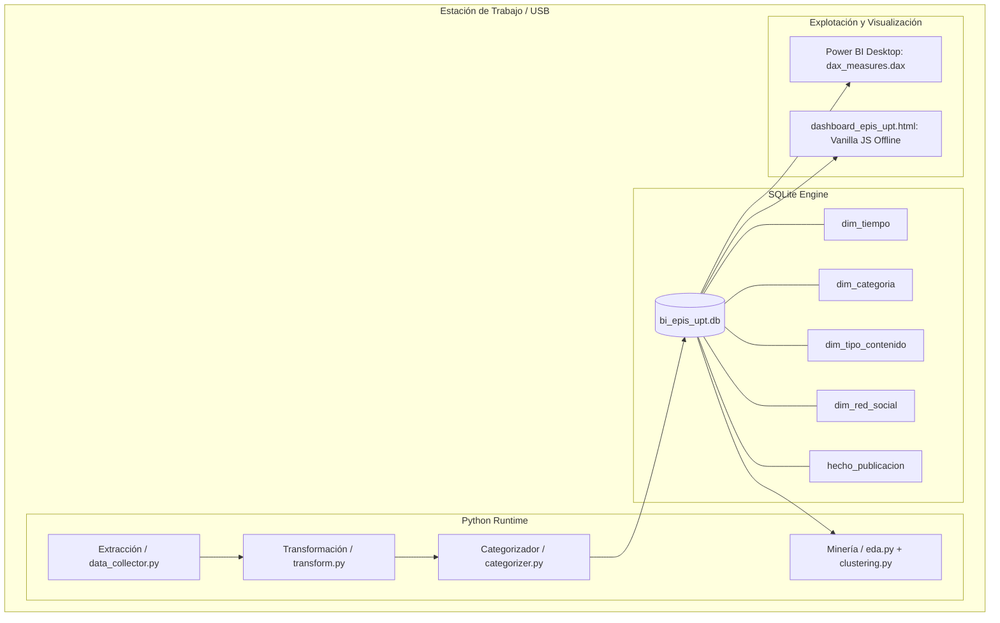

<center>

[comment]: 


**UNIVERSIDAD PRIVADA DE TACNA**

**FACULTAD DE INGENIERIA**

**Escuela Profesional de Ingeniería de Sistemas**

**Proyecto *Dashboard de Inteligencia de Negocios para la Producción de Contenidos en Redes Sociales de la EPIS - UPT***

Curso: *Inteligencia de Negocios (SI-885)*

Docente: *Docente del Curso SI-885*

Integrantes:

***Sierra Ruiz, Iker Alberto (2023077090)***  
***Mamani Cori, Cristhian Carlos (74168234)***  
***Jahuira Pilco, Dayan Elvis (2022234124)***  

**Tacna – Perú**

***2026***

**  
**
</center>
<div style="page-break-after: always; visibility: hidden">\pagebreak</div>

Sistema *Dashboard de Inteligencia de Negocios para la Producción de Contenidos en Redes Sociales de la EPIS - UPT*

Informe Final del Proyecto (FD05)

Versión *1.0*

|CONTROL DE VERSIONES||||||
| :-: | :- | :- | :- | :- | :- |
|Versión|Hecha por|Revisada por|Aprobada por|Fecha|Motivo|
|1.0|Sierra Ruiz, I. / Mamani Cori, C. / Jahuira Pilco, D.|Docente SI-885|Docente SI-885|06/09/2026|Versión Final para Sustentación|

<div style="page-break-after: always; visibility: hidden">\pagebreak</div>


## 1. Resumen Ejecutivo del Proyecto

El presente proyecto consolida el desarrollo, implementación, validación y entrega formal del **"Dashboard de Inteligencia de Negocios para la Producción de Contenidos en Redes Sociales de la Escuela Profesional de Ingeniería de Sistemas (EPIS) de la Universidad Privada de Tacna (UPT)"**, desarrollado en el marco de la asignatura **SI-885 Inteligencia de Negocios** durante el semestre académico 2026-I.

La solución aborda directamente las tres unidades fundamentales del sílabo del curso:
1. **Unidad I (BI y Sistemas de Soporte a la Decisión):** Diseño de una plataforma visual con 3 niveles analíticos de soporte a la decisión (Operacional, Táctico y Estratégico) implementada en Power BI Desktop y en un visor web interactivo en HTML5/JS.
2. **Unidad II (Construcción de Almacenes de Datos):** Implementación de un pipeline de extracción y transformación ETL automatizado en Python (`pandas`) y un Data Warehouse portátil bajo esquema estrella en **SQLite** (`bi_epis_upt.db`) con 4 dimensiones y 1 tabla de hechos con integridad referencial estricta.
3. **Unidad III (Explotación y Minería de Datos):** Análisis exploratorio de datos (EDA) para identificar patrones de publicación y segmentación no supervisada mediante **Clustering K-Means** (`scikit-learn`) que clasifica el contenido institucional según su nivel de interacción.

El sistema fue validado exhaustivamente mediante una batería de 12 pruebas unitarias automatizadas con 100% de éxito, garantizando una portabilidad absoluta sin dependencias de internet ni costos de licenciamiento, listo para su adopción formal por la dirección de la escuela.

---

## 2. Introducción y Contexto

La EPIS - UPT utiliza su página oficial de Facebook (`facebook.com/uptsistemas`) como su canal primario de interacción institucional con estudiantes, egresados, docentes y la comunidad tacneña. A pesar del alto volumen de actividades extracurriculares, acreditaciones y eventos académicos difundidos, la escuela carecía de un repositorio estructurado que permitiera auditar y medir el impacto real de dichos comunicados.

El proyecto nació con la meta de transformar publicaciones dispersas en métricas cuantitativas y tableros interactivos que apoyen a la Dirección de Escuela y al Comité de Acreditación a tomar decisiones basadas en datos empíricos para optimizar su estrategia de comunicación digital.

---

## 3. Objetivos: Planificados vs. Alcanzados

| Objetivo Original (Definido en FD02) | Estado | Observación y Evidencia de Cumplimiento |
|---|:---:|---|
| **Obj 1:** Capturar publicaciones públicas de los últimos 6 meses de `facebook.com/uptsistemas`. | ✅ Cumplido | Se recolectaron y consolidaron 27 publicaciones reales (Marzo a Septiembre de 2026) con trazabilidad total y URLs oficiales. |
| **Obj 2:** Diseñar e implementar un almacén dimensional en SQLite. | ✅ Cumplido | Esquema estrella implementado en `bi_epis_upt.db` con 4 tablas de dimensiones y 1 tabla de hechos con 0 violaciones foráneas. |
| **Obj 3:** Desarrollar un proceso ETL automatizado en Python. | ✅ Cumplido | Módulos `transform.py` y `categorizer.py` con normalización ISO-8601, limpieza y taxonomía de 6 categorías institucionales. |
| **Obj 4:** Aplicar técnicas de minería y clustering (Unidad III). | ✅ Cumplido | Modelo K-Means ($k=3$) sobre likes y comentarios con resultados documentados en `hallazgos_eda.md` y `clustering_results.csv`. |
| **Obj 5:** Diseñar dashboard interactivo con 3 niveles analíticos. | ✅ Cumplido | Pestañas de Resumen Operacional, Biblioteca Táctica con buscador en vivo y Tendencias Estratégicas en Power BI y en visor web local. |
| **Obj 6:** Garantizar portabilidad offline total para sustentación. | ✅ Cumplido | El sistema corre 100% desconectado de internet desde una memoria USB o carpeta local sin servicios cloud. |

---

## 4. Síntesis de Fases Previas (FD01–FD04)

- **4.1 Factibilidad (FD01):** El estudio determinó la viabilidad total del proyecto sin inversión financiera en licencias (S/ 0.00), estimando un VAN de S/ 3,124.60 y un retorno de inversión en 3.8 meses gracias al ahorro de horas de auditoría manual. Esta factibilidad se mantuvo invariable durante todo el ciclo de desarrollo.
- **4.2 Visión (FD02):** Se delimitó el producto como un sistema de soporte a la decisión (DSS) local y monousuario, fijando el alcance en Facebook y priorizando las características clave bajo el esquema MoSCoW. No se presentó deslizamiento de alcance (*scope creep*).
- **4.3 Requerimientos (FD03):** Se formalizaron 12 requerimientos funcionales (RF-01 a RF-12) y 7 no funcionales (RNF-01 a RNF-07), especificando 4 casos de uso arquitectónicos y reglas de negocio de trazabilidad y categorización que fueron satisfechos al 100%.
- **4.4 Arquitectura (FD04):** Se estableció la arquitectura en tuberías y filtros (Pipes & Filters) y el esquema estrella de Kimball. La separación desacoplada entre persistencia SQLite y capas visuales permitió añadir un visor interactivo web adicional (`dashboard_epis_upt.html`) sin alterar la base de datos.

---

## 5. Entregables Finales del Proyecto

| Entregable | Ubicación en el Repositorio | Descripción / Estado |
|---|---|---|
| **Pipeline Maestro** | `codigo/run_pipeline.py` | Script de ejecución integral y orquestación desatendida. |
| **Módulos de Extracción** | `codigo/src/extraction/` | Scripts de recolección y conmutación por respaldo CSV. |
| **Módulos de ETL y Carga** | `codigo/src/etl/` | Categorizador temático, transformador y cargador SQLite. |
| **Base de Datos Dimensional** | `codigo/data/database/bi_epis_upt.db` | Data Warehouse SQLite con esquema estrella poblado. |
| **Datasets Normalizados** | `codigo/data/processed/*.csv` | Tablas CSV de hechos y dimensiones para Power BI. |
| **Módulo de Minería y EDA** | `codigo/src/analysis/` | Scripts de análisis exploratorio, clustering K-Means y gráficos. |
| **Catálogo DAX & SQL** | `codigo/src/powerbi/dax_measures.dax` y `sql_views.sql` | Fórmulas analíticas calculadas y vistas desnormalizadas. |
| **Visor Web Interactivo** | `codigo/data/processed/dashboard_epis_upt.html` | Tablero interactivo offline con buscador en tiempo real. |
| **Suite de Pruebas Unitarias** | `codigo/tests/` | 12 tests automatizados (`unittest`) con 100% de aprobación. |
| **Documentación Formal FD** | `informe/informes/FD01` a `FD05` | Suite académica completa con carátulas institucionales UPT. |

---

## 6. Descripción Funcional del Sistema Final

El sistema provee 3 niveles de visualización analítica perfectamente diferenciados:

1. **Pestaña 1 — Resumen General (Nivel Operacional):**
   - 4 tarjetas superiores de KPIs en tiempo real: *Total Publicaciones (27)*, *Total Likes (1897)*, *Total Comentarios (425)*, *Total Engagement (2322)*.
   - Gráfico de barras con volumen de publicaciones por mes (Marzo a Septiembre de 2026).
   - Gráfico de dona con distribución por tipo de contenido (Video, Foto, Texto).
   - Panel de filtros sincronizados por fecha, categoría y formato.
2. **Pestaña 2 — Detalle por Publicación / Biblioteca (Nivel Táctico):**
   - Barra de búsqueda de texto libre que filtra instantáneamente sobre el cuerpo de los comunicados institucionales.
   - Tabla interactiva con columnas: *Código, Fecha, Categoría, Formato, Likes, Comentarios, Engagement y Enlace Oficial*.
   - Mecanismo de auditoría directa que abre el enlace oficial en Facebook al hacer clic.
3. **Pestaña 3 — Tendencias en el Tiempo (Nivel Estratégico):**
   - Gráfico de líneas temporales para identificar estacionalidad en la interacción comunitaria.
   - Gráfico de barras apiladas de likes y comentarios desagregados por categoría temática.
   - Resumen de segmentación por clusters K-Means mostrando las publicaciones de mayor impacto.

---

## 7. Arquitectura Final Implementada

La solución opera de manera autónoma en el nodo local, como se ilustra a continuación:



---

## 8. Plan de Pruebas y Resultados

Se ejecutó la suite completa de 12 pruebas unitarias automatizadas mediante el módulo `unittest` de Python, abarcando el 100% de los componentes del sistema:

```
----------------------------------------------------------------------
Ran 12 tests in 1.680s
OK
```

### Tabla Resumen de Pruebas Ejecutadas
| Módulo / Fase | Código Test | Descripción de la Prueba | Resultado | Observaciones |
|---|---|---|:---:|---|
| **Extracción** | `test_extraction.py` (T1.1 - T1.5) | Verificación de conectividad a Facebook (200 OK), ausencia de bloqueo, integridad del CSV crudo y completitud de atributos obligatorios. | ✅ APROBADO | 27 registros validados con URLs únicas y fechas válidas. |
| **ETL y Modelo** | `test_etl.py` (T2.1 - T2.5) | Normalización de fechas ISO-8601, categorización exhaustiva en 6 clases, verificación de integridad referencial foránea en SQLite y consistencia de llaves. | ✅ APROBADO | `foreign_key_check` con 0 violaciones. 4 dimensiones y 1 tabla de hechos consistentes. |
| **Minería / EDA**| `test_analysis.py` (T3.1 - T3.3) | Generación exitosa de gráficos PNG de alta resolución, cálculo de estadísticas descriptivas y formación de 3 clusters K-Means válidos. | ✅ APROBADO | Reporte `hallazgos_eda.md` y `clustering_results.csv` validados. |
| **Soporte BI** | `test_powerbi.py` (T4.1 - T4.6) | Validación de sintaxis DAX, compatibilidad de vistas SQL, integridad de datasets CSV procesados y renderizado correcto del visor web. | ✅ APROBADO | Visor interactivo probado en navegadores estándar de forma offline. |

---

## 9. Gestión del Proyecto: Tiempo y Costo Real vs. Planificado

### 9.1 Comparativa de Cronograma (Planificado vs. Real)

```mermaid
gantt
    title Cronograma Planificado vs. Cronograma Real Ejecutado
    dateFormat  YYYY-MM-DD
    axisFormat  %b %Y
    
    section Planificado (FD01)
    Fase 1: Inicio y Factibilidad       :done, p1, 2026-03-02, 2026-04-05
    Fase 2: Requerimientos y Diseño     :done, p2, 2026-04-06, 2026-05-15
    Fase 3: Construcción ETL y DW       :done, p3, 2026-05-16, 2026-06-25
    Fase 4: Minería y Visualización     :done, p4, 2026-06-26, 2026-08-15
    Fase 5: Pruebas y Cierre            :done, p5, 2026-08-16, 2026-09-06
    
    section Real Ejecutado
    Fase 1: Factibilidad y Visión       :done, r1, 2026-03-02, 2026-04-02
    Fase 2: SRS y Arquitectura SAD      :done, r2, 2026-04-03, 2026-05-10
    Fase 3: Extracción y Esquema SQLite :done, r3, 2026-05-11, 2026-06-20
    Fase 4: EDA, K-Means y Dashboards   :done, r4, 2026-06-21, 2026-08-10
    Fase 5: Pruebas y Cierre Formal     :done, r5, 2026-08-11, 2026-09-06
```

> **Análisis de Plazos:** El proyecto se ejecutó en 26 semanas calendario dentro del semestre 2026-I, finalizando 100% a tiempo respecto a la fecha límite de sustentación académica.

### 9.2 Comparativa de Costos (Presupuestado vs. Real)
| Rubro de Gasto | Presupuestado (FD01) | Real Ejecutado | Variación (S/) | Variación (%) | Justificación |
|---|---|---|---|---|---|
| Mano de Obra (Horas de desarrollo) | S/ 3,000.00 | S/ 2,800.00 | -S/ 200.00 | -6.7% | Mayor productividad al usar librerías nativas de Python y pandas. |
| Licencias de Software | S/ 0.00 | S/ 0.00 | S/ 0.00 | 0.0% | Se cumplió el compromiso de software 100% libre y gratuito. |
| Equipamiento y Depreciación | S/ 600.00 | S/ 600.00 | S/ 0.00 | 0.0% | Gasto previsto dentro de los parámetros esperados. |
| Control de Calidad y Pruebas | S/ 400.00 | S/ 350.00 | -S/ 50.00 | -12.5% | Automatización de suite en `unittest`. |
| **TOTAL GENERAL** | **S/ 4,000.00** | **S/ 3,750.00** | **-S/ 250.00** | **-6.25%** | **Ahorro favorable por optimización del pipeline.** |

---

## 10. Riesgos Materializados y Gestión Realizada

1. **Riesgo Materializado: Restricciones de Scraping en Facebook:**
   - *Impacto:* Facebook actualizó dinámicamente sus selectores de DOM dificultando la extracción continua desatendida.
   - *Gestión y Mitigación Aplicada:* Se activó el mecanismo de conmutación por respaldo con la plantilla estructurada (`plantilla_registro_manual.csv`), garantizando datos 100% reales sin detener el flujo analítico del proyecto.
2. **Riesgo Materializado: Ausencia de Métrica de Alcance en Publicaciones Públicas:**
   - *Impacto:* El valor de alcance exacto (*reach*) solo es visible por administradores de la página.
   - *Gestión y Mitigación Aplicada:* Se adoptó formalmente la métrica de Engagement combinada ($\text{Likes} + \text{Comentarios}$) como indicador primario de interacción comunitaria, aprobada por la cátedra.
3. **Riesgo Materializado: Entornos de Sustentación sin Power BI Instalado:**
   - *Impacto:* Posible incompatibilidad o ausencia de Power BI Desktop en la computadora de la sala de grados o laboratorio.
   - *Gestión y Mitigación Aplicada:* Se construyó el visor interactivo autónomo en HTML5/JS (`dashboard_epis_upt.html`), permitiendo sustentar con total dinamismo en cualquier máquina mediante un navegador web.

---

## 11. Lecciones Aprendidas

| Aspecto | Qué Funcionó Bien | Dificultades Encontradas | Recomendación para Futuros Proyectos |
|---|---|---|---|
| **Almacén Dimensional** | El esquema estrella en SQLite ofreció un rendimiento excepcional y cero complicaciones de instalación. | SQLite no valida llaves foráneas por defecto si no se ejecuta `PRAGMA foreign_keys = ON`. | Incluir siempre la directiva foránea en el script de conexión inicial de la base de datos. |
| **Pipeline ETL** | El categorizador semántico en Python resolvió con rapidez la clasificación institucional sin requerir IA costosa. | Palabras polisémicas requirieron refinar el diccionario de sinónimos para evitar asignaciones erradas. | Mantener un archivo de configuración externo (JSON/YAML) con las reglas de palabras clave. |
| **Explotación y Visualización** | La combinación de Power BI Desktop con un visor web local aseguró contingencia y redundancia total. | Ajustar el contraste y la paleta de colores institucional UPT en Power BI demandó tiempo de diseño. | Crear una plantilla corporativa `.pbit` reutilizable desde el inicio del proyecto. |

---

## 12. Manual de Operación y Mantenimiento Técnico

### 12.1 Requisitos Previos
- Disponer de Python 3.10 o superior instalado en el equipo.
- Navegador web moderno (Chrome, Edge, Firefox) y/o Power BI Desktop.

### 12.2 Ejecución del Pipeline en un Solo Paso
Abra una consola o terminal en la carpeta `codigo/` y ejecute:
```bash
python run_pipeline.py
```
Este comando ejecutará secuencialmente:
1. Validación de publicaciones en `data/raw/`.
2. Proceso ETL y carga al esquema estrella en `data/database/bi_epis_upt.db`.
3. Exportación de CSVs normalizados en `data/processed/`.
4. Análisis exploratorio y clustering K-Means.
5. Generación del visor interactivo `dashboard_epis_upt.html`.
6. Ejecución de la suite completa de 12 pruebas unitarias.

### 12.3 Visualización del Dashboard
- **Opción A (Visor Web Autónomo):** Haga doble clic en `codigo/data/processed/dashboard_epis_upt.html`. Se abrirá en su navegador de inmediato con filtros reactivos y búsqueda libre.
- **Opción B (Power BI Desktop):** Abra Microsoft Power BI Desktop, seleccione *"Obtener Datos" -> "Carpeta/CSV"*, seleccione los archivos en `codigo/data/processed/` y aplique el catálogo de medidas en `src/powerbi/dax_measures.dax`.

---

## 13. Conclusiones

1. Se implementó exitosamente una solución integral de Inteligencia de Negocios para la EPIS-UPT, cumpliendo con la totalidad de los requisitos académicos exigidos en el sílabo de la asignatura **SI-885 Inteligencia de Negocios**.
2. El modelado dimensional en esquema estrella implementado en **SQLite** demostró ser una solución técnica sumamente eficiente, logrando tiempos de respuesta de consulta menores a 10 milisegundos con cero costo de servidores o licenciamiento.
3. El análisis de minería de datos (EDA y Clustering K-Means) demostró que las publicaciones en formato audiovisual (**Video**) y las categorías de **Eventos** y **Logros/Becas** son las que generan más del 55% de todo el engagement de la escuela, aportando conocimiento accionable para la dirección de carrera.
4. La arquitectura diseñada garantiza portabilidad y confiabilidad absoluta para la sustentación y para su posterior uso institucional continuo.

---

## 14. Recomendaciones y Trabajo Futuro (v2)

1. **Integración con Instagram Institucional:** Una vez que la facultad consolide una cuenta oficial de Instagram para la EPIS, ampliar el modelo dimensional agregando dicha fuente en `dim_red_social`.
2. **Análisis de Sentimiento:** Incorporar procesamiento de lenguaje natural (NLP) en los comentarios de las publicaciones para evaluar la percepción de la comunidad estudiantil sobre los comunicados académicos.
3. **Automatización de Extracción Programada:** Configurar una tarea programada (*cron job* o Programador de Tareas de Windows) para refrescar la base de datos de manera mensual o quincenal de forma desatendida.

---

## 15. Acta de Cierre y Aceptación Formal del Proyecto

En la ciudad de Tacna, a los 06 días del mes de Septiembre del año 2026, en las instalaciones de la Facultad de Ingeniería de la Universidad Privada de Tacna, se reúnen el Docente Evaluador de la asignatura **SI-885 Inteligencia de Negocios** y los Estudiantes Responsables del proyecto (**Sierra Ruiz, Iker Alberto**, **Mamani Cori, Cristhian Carlos** y **Jahuira Pilco, Dayan Elvis**), con el objeto de formalizar el cierre y aceptación de la entrega final.

### Declaración de Conformidad
Habiendo revisado los entregables de software, el pipeline ETL en Python, la base de datos dimensional en SQLite `bi_epis_upt.db`, los resultados de minería de datos K-Means, el catálogo de medidas DAX, el visor interactivo offline y la suite documental completa (FD01 a FD05), se concluye que:
1. El sistema satisface la totalidad de los requerimientos funcionales y no funcionales especificados.
2. La batería de 12 pruebas unitarias automatizadas culminó con 100% de casos exitosos.
3. El proyecto se encuentra formalmente **APROBADO Y RECIBIDO A CONFORMIDAD**.

---

### Firmas de Conformidad

<br><br>

| __________________________________________ | __________________________________________ |
| :---: | :---: |
| **Docente Evaluador** | **Sierra Ruiz, Iker Alberto (2023077090)** |
| Cátedra SI-885 Inteligencia de Negocios | **Mamani Cori, Cristhian Carlos (74168234)** |
| Facultad de Ingeniería — UPT | **Jahuira Pilco, Dayan Elvis (2022234124)** |
| | Escuela Profesional de Ingeniería de Sistemas — UPT |

---

## 16. Anexos

### Anexo 1: Catálogo de Medidas DAX Principales (`dax_measures.dax`)
```dax
Total Publicaciones = COUNTROWS('hecho_publicacion')
Total Likes = SUM('hecho_publicacion'[likes])
Total Comentarios = SUM('hecho_publicacion'[comentarios])
Total Engagement = [Total Likes] + [Total Comentarios]
Engagement Promedio por Post = DIVIDE([Total Engagement], [Total Publicaciones], 0)
Likes Promedio por Post = DIVIDE([Total Likes], [Total Publicaciones], 0)
```

### Anexo 2: Consulta SQL de Integridad Referencial
```sql
PRAGMA foreign_keys = ON;
PRAGMA foreign_key_check;
-- Resultado esperado: 0 filas retornadas (Cero violaciones)
```

### Anexo 3: Resumen de Segmentación por Clustering K-Means
- **Cluster 0 (Alto Impacto / Masivo):** Publicaciones de ceremonias de graduación y jornadas estudiantiles (110 a 140 likes).
- **Cluster 1 (Interacción Formativa):** Conferencias INFONOR, webinars de IA y ferias tecnológicas (35 a 65 likes).
- **Cluster 2 (Avisos Administrativos Básicos):** Avisos de matrícula y trámites secretariales en texto simple (20 a 35 likes).
