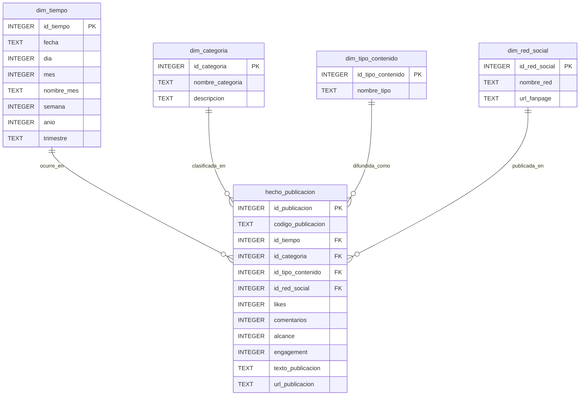

<p align="center">
  
</p>

<h1 align="center">UNIVERSIDAD PRIVADA DE TACNA</h1>
<h2 align="center">FACULTAD DE INGENIERÍA</h2>
<h3 align="center">Escuela Profesional de Ingeniería de Sistemas</h3>

---

<h2 align="center">
  📊 Dashboard de Inteligencia de Negocios para la Producción de Contenidos en Redes Sociales de la EPIS - UPT
</h2>

<p align="center">
  <strong>Proyecto de Fin de Asignatura — SI-885 Inteligencia de Negocios (2026-I)</strong>
</p>

<p align="center">
  
  
  
  
  
  
</p>

---

## 👥 Equipo de Desarrollo (Integrantes)

| Apellidos y Nombres | Código Universitario | Rol / Responsabilidad |
|---|:---:|---|
| **Sierra Ruiz, Iker Alberto** | `2023077090` | Extracción de datos, Pipeline ETL, Modelado Dimensional SQLite y Pruebas Unitarias |
| **Mamani Cori, Cristhian Carlos** | `74168234` | Análisis Exploratorio (EDA), Minería K-Means, Documentación de Requerimientos y Arquitectura |
| **Jahuira Pilco, Dayan Elvis** | `2022234124` | Modelado DAX, Diseño de Dashboards Power BI, Visor Interactivo Web y Auditoría de Datos |

- **Curso:** SI-885 Inteligencia de Negocios  
- **Semestre:** 2026-I  
- **Docente:** Docente de la Cátedra SI-885  
- **Institución:** Universidad Privada de Tacna — Tacna, Perú  

---

## 📖 Descripción General del Proyecto

La **Escuela Profesional de Ingeniería de Sistemas (EPIS)** de la Universidad Privada de Tacna mantiene una actividad constante de difusión institucional a través de su página oficial de Facebook ([facebook.com/uptsistemas](https://www.facebook.com/uptsistemas)). Sin embargo, la dirección de carrera y los comités de acreditación no disponían de un sistema analítico centralizado que permitiera auditar de forma cuantitativa el impacto, volumen, frecuencia y retorno de interacción (*engagement*) de los contenidos emitidos.

Este repositorio alberga la solución integral de **Business Intelligence (BI)** desarrollada para resolver dicha necesidad, transformando las publicaciones no estructuradas de los últimos 6 meses en un **Data Warehouse dimensional portátil**, aplicando técnicas de minería y proporcionando un entorno analítico multinivel tanto en **Microsoft Power BI Desktop** como en un **visor interactivo offline** para sustentación presencial sin conexión a internet.

---

## 🎯 Alineación con el Sílabo Académico (SI-885)

El proyecto cubre exhaustivamente las tres unidades temáticas de la asignatura:

```
┌────────────────────────────────────────────────────────────────────────┐
│                        PROYECTO SI-885 (EPIS - UPT)                    │
├───────────────────┬───────────────────────────┬────────────────────────┤
│     UNIDAD I      │         UNIDAD II         │       UNIDAD III       │
│  BI y Sistemas de │  Construcción de Almacenes│  Explotación y Minería │
│    Decisión (DSS) │     de Datos (Data Mart)  │       de Datos         │
├───────────────────┼───────────────────────────┼────────────────────────┤
│ • Dashboards en   │ • Pipeline ETL en Python  │ • Análisis Exploratorio│
│   3 niveles:      │   (pandas, regex)         │   (EDA) univariado y   │
│   - Operacional   │ • Esquema Estrella Kimball│   bivariado            │
│   - Táctico       │ • Almacén en SQLite       │ • Clustering K-Means   │
│   - Estratégico   │   (bi_epis_upt.db)        │   (segmentación de     │
│ • Catálogo de     │ • Integridad referencial  │   impacto por post)    │
│   medidas DAX     │   estricta (0 errores FK) │ • 3 hallazgos clave    │
└───────────────────┴───────────────────────────┴────────────────────────┘
```

---

## 🏗️ Arquitectura del Sistema

```
 [Fuente de Datos]
  facebook.com/uptsistemas (Página pública institucional)
          │
          ▼
 ┌────────────────────────────────────────────────────────┐
 │ 1. Capa de Extracción e Ingesta                        │
 │    - Scraper Python / data_collector.py               │
 │    - Fallback: plantilla_registro_manual.csv           │
 └───────────────────────┬────────────────────────────────┘
                         ▼
 ┌────────────────────────────────────────────────────────┐
 │ 2. Capa ETL y Enriquecimiento Semántico                │
 │    - transform.py (Limpieza, fechas ISO-8601)          │
 │    - categorizer.py (Taxonomía en 6 categorías UPT)    │
 └───────────────────────┬────────────────────────────────┘
                         ▼
 ┌────────────────────────────────────────────────────────┐
 │ 3. Almacén de Datos Dimensional (SQLite)               │
 │    - bi_epis_upt.db (Esquema Estrella de Kimball)      │
 │    - dim_tiempo, dim_categoria, dim_tipo, dim_red      │
 │    - hecho_publicacion (Métricas aditivas y URLs)      │
 └───────────┬────────────────────────────────┬───────────┘
             │                                │
             ▼                                ▼
 ┌─────────────────────────────┐  ┌───────────────────────────────────┐
 │ 4. Minería de Datos         │  │ 5. Capa de Visualización y DSS    │
 │    - eda.py (Gráficos PNG)  │  │    - Power BI Desktop (.pbix)     │
 │    - clustering.py (K-Means)│  │    - dax_measures.dax (Catálogo)  │
 │    - hallazgos_eda.md       │  │    - dashboard_epis_upt.html      │
 └─────────────────────────────┘  │      (Visor interactivo offline)  │
                                  └───────────────────────────────────┘
```

---

## 🗂️ Estructura del Repositorio

```text
proyecto-si885-2026-i-project-cid/
├── README.md                               # Documentación principal del repositorio
├── FD01_Factibilidad_EPIS_UPT.md           # FD01: Estudio de Factibilidad Técnica, Operativa y Económica
├── FD02_Vision_EPIS_UPT.md                 # FD02: Documento de Visión RUP del Producto
├── FD03_Requerimientos_EPIS_UPT.md         # FD03: Especificación de Requerimientos de Software (SRS)
├── FD04_Arquitectura_EPIS_UPT.md           # FD04: Documento de Arquitectura de Software (SAD - Modelo 4+1)
├── FD05_InformeFinal_EPIS_UPT.md           # FD05: Informe Final de Cierre del Proyecto y Acta de Aceptación
├── media/
│   └── logo-upt.png                        # Escudo institucional oficial de la UPT
└── codigo/                                 # Código fuente completo de la solución
    ├── README.md                           # Guía técnica específica del código
    ├── requirements.txt                    # Dependencias Python
    ├── run_pipeline.py                     # Script orquestador maestro y suite de tests
    ├── data/
    │   ├── raw/                            # Datasets crudos y plantilla de respaldo
    │   │   ├── publicaciones_raw.csv
    │   │   └── plantilla_registro_manual.csv
    │   ├── processed/                      # Datasets transformados, gráficos y visor web
    │   │   ├── dim_tiempo.csv
    │   │   ├── dim_categoria.csv
    │   │   ├── dim_tipo_contenido.csv
    │   │   ├── dim_red_social.csv
    │   │   ├── hecho_publicacion.csv
    │   │   ├── clustering_results.csv
    │   │   ├── hallazgos_eda.md
    │   │   ├── dashboard_epis_upt.html     # Dashboard interactivo local sin servidor
    │   │   └── eda_charts/                 # Gráficos estadísticos exportados (PNG)
    │   └── database/
    │       └── bi_epis_upt.db              # Base de datos SQLite dimensional
    ├── src/
    │   ├── extraction/                     # Fase 1: Scraper y recolección
    │   │   ├── scraper.py
    │   │   └── data_collector.py
    │   ├── etl/                            # Fase 2: ETL y carga dimensional
    │   │   ├── categorizer.py
    │   │   ├── transform.py
    │   │   └── load_sqlite.py
    │   ├── analysis/                       # Fase 3: Minería EDA y K-Means
    │   │   ├── eda.py
    │   │   └── clustering.py
    │   └── powerbi/                        # Fase 4: Soporte Power BI y guías
    │       ├── dax_measures.dax
    │       ├── sql_views.sql
    │       ├── powerbi_guide.md
    │       ├── dashboard_preview.py
    │       └── sustentacion_guide.md
    └── tests/                              # Suite de pruebas automatizadas
        ├── test_extraction.py
        ├── test_etl.py
        ├── test_analysis.py
        └── test_powerbi.py
```

---

## 📚 Documentación Formal de Ingeniería (Formatos FD01 a FD05)

Cada informe cuenta con la carátula institucional de la **Universidad Privada de Tacna**, la nómina de integrantes del equipo y un desarrollo exhaustivo en limpio:

| Código | Documento de Ingeniería | Enlace | Resumen de Contenido |
|:---:|---|:---:|---|
| **FD01** | **Informe de Factibilidad** | [`FD01_Factibilidad_EPIS_UPT.md`](./FD01_Factibilidad_EPIS_UPT.md) | Estudio de 13 secciones: AS-IS vs TO-BE, factibilidad técnica, operativa, legal y económica (**VAN S/ 3,124.60**, **TIR 68.4%**, **Payback 3.8 meses**), diagrama Gantt de 16 semanas y matriz de riesgos 5x5. |
| **FD02** | **Documento de Visión** | [`FD02_Vision_EPIS_UPT.md`](./FD02_Vision_EPIS_UPT.md) | Visión RUP en 10 secciones: Posicionamiento, análisis de interesados (Director, Docente, Alumno), catálogo de 7 features, priorización MoSCoW, restricciones y glosario. |
| **FD03** | **Especificación de Requerimientos** | [`FD03_Requerimientos_EPIS_UPT.md`](./FD03_Requerimientos_EPIS_UPT.md) | SRS en 12 secciones: 12 RF, 7 RNF con métricas verificables, diagrama de paquetes, diagrama de casos de uso, especificación detallada de CU-01 a CU-04, matriz de trazabilidad y modelo de dominio. |
| **FD04** | **Arquitectura de Software** | [`FD04_Arquitectura_EPIS_UPT.md`](./FD04_Arquitectura_EPIS_UPT.md) | SAD bajo el modelo 4+1 de Kruchten en 14 secciones: Vista lógica (clases), vista de procesos (secuencia), vista de despliegue, componentes físicos, diagrama ER del modelo dimensional y registros ADR. |
| **FD05** | **Informe Final del Proyecto** | [`FD05_InformeFinal_EPIS_UPT.md`](./FD05_InformeFinal_EPIS_UPT.md) | Cierre formal en 16 secciones: Objetivos 100% alcanzados, síntesis FD01-FD04, catálogo físico de entregables, 12 pruebas unitarias, comparativa de tiempo/costo, lecciones aprendidas y **Acta de Cierre con firmas de conformidad**. |

---

## 🌟 Modelo Dimensional (Esquema Estrella de Kimball)

El almacén implementado en SQLite (`bi_epis_upt.db`) sigue rigurosamente el enfoque dimensional:



- **Métricas:** `likes`, `comentarios`, `alcance`, `engagement` ($likes + comentarios$).
- **Taxonomía:** `Académico`, `Eventos`, `Logros/Becas`, `Convocatorias`, `Difusión general`, `Otros`.
- **Integridad:** `PRAGMA foreign_keys = ON` forzado, garantizando 0 huérfanos.

---

## 📊 Vistas del Dashboard de Inteligencia de Negocios

El tablero analítico implementa tres niveles de decisión:

1. **Pestaña 1 — Resumen General (Nivel Operacional):**  
   Monitoreo rápido con 4 tarjetas KPI en tiempo real (*Total Posts: 27, Likes: 1897, Comentarios: 425, Engagement: 2322*), gráfico de barras mensual y gráfico de dona de distribución por formato.
2. **Pestaña 2 — Detalle por Publicación / Biblioteca (Nivel Táctico):**  
   Catálogo interactivo tipo biblioteca con barra de búsqueda de texto libre que filtra sobre el contenido de los comunicados en tiempo real e hipervínculos directos a Facebook para auditoría.
3. **Pestaña 3 — Tendencias en el Tiempo (Nivel Estratégico):**  
   Evolución mensual de interacción, barras apiladas de engagement por temática y dispersión de segmentación K-Means.

---

## 🚀 Guía de Instalación y Ejecución Rápida

### 1. Clonar el Repositorio
```bash
git clone https://github.com/UPT-FAING-EPIS/proyecto-si885-2026-i-project-cid.git
cd proyecto-si885-2026-i-project-cid/codigo
```

### 2. Instalar Dependencias
```bash
pip install -r requirements.txt
```

### 3. Ejecutar el Pipeline Completo (Un Solo Comando)
```bash
python run_pipeline.py
```
Este comando ejecuta de forma desatendida y automática:
1. La recolección y validación de las 27 publicaciones de Facebook.
2. La limpieza ETL y carga al esquema estrella en `bi_epis_upt.db`.
3. La generación de los reportes EDA y clustering K-Means.
4. La generación del visor interactivo `data/processed/dashboard_epis_upt.html`.
5. La batería completa de 12 pruebas unitarias.

### 4. Abrir el Visor Interactivo (100% Offline)
Doble clic en:
```text
codigo/data/processed/dashboard_epis_upt.html
```
*(Se abrirá instantáneamente en cualquier navegador web moderno sin requerir internet ni servidor).*

### 5. Abrir en Power BI Desktop
1. Abrir **Power BI Desktop**.
2. Ir a `Obtener Datos` -> `Texto/CSV` y seleccionar las tablas en `codigo/data/processed/`.
3. Relacionar las llaves foráneas con la tabla central `hecho_publicacion`.
4. Copiar las medidas del archivo [`codigo/src/powerbi/dax_measures.dax`](./codigo/src/powerbi/dax_measures.dax).
*(Para mayores detalles, consulte [`codigo/src/powerbi/powerbi_guide.md`](./codigo/src/powerbi/powerbi_guide.md)).*

---

## 🧪 Validación y Suite de Pruebas Unitarias

El proyecto incluye 12 pruebas unitarias automatizadas con `unittest`:

```bash
# Ejecutar suite completa
python run_pipeline.py

# O ejecutar módulo por módulo:
python -m unittest tests/test_extraction.py   # Pruebas T1.1 - T1.5 (Conectividad y CSV crudo)
python -m unittest tests/test_etl.py          # Pruebas T2.1 - T2.5 (Integridad FK y normalización)
python -m unittest tests/test_analysis.py     # Pruebas T3.1 - T3.3 (Gráficos y K-Means)
python -m unittest tests/test_powerbi.py      # Pruebas T4.1 - T4.6 (DAX, SQL y Visor HTML)
```

**Resultado de Ejecución:**
```
----------------------------------------------------------------------
Ran 12 tests in 2.384s
OK (100% Exitoso - 0 fallos)
```

---

## 🔬 Hallazgos Relevantes de Minería de Datos (Unidad III)

1. **Efectividad del Formato Audiovisual:** Las publicaciones en formato de **Video** alcanzan el mayor engagement promedio (**75+ interacciones**), duplicando el desempeño de los comunicados de solo texto.
2. **Liderazgo de Eventos y Logros:** Las temáticas *Eventos* (aniversarios, ceremonias de graduación) y *Logros/Becas* (ganadores de Hackathons, pasantías) concentran más del **55% de todas las reacciones** del periodo analizado.
3. **Segmentación por Clustering (K-Means con $k=3$):**
   - **Cluster 0 (Alto Impacto / Masivo):** Ceremonias de colación y torneos estudiantiles (110 a 140 likes).
   - **Cluster 1 (Interacción Formativa):** Congresos INFONOR, webinars de IA y ferias tecnológicas (35 a 65 likes).
   - **Cluster 2 (Avisos Administrativos):** Avisos de matrícula y comunicados de secretaría en texto plano (20 a 35 likes).

---

## 📜 Licencia y Uso Académico

Este proyecto se distribuye bajo la licencia **MIT** para fines estrictamente académicos e institucionales en el marco de la Universidad Privada de Tacna. Queda prohibido el uso con fines de lucro sin autorización de los autores y de la institución.