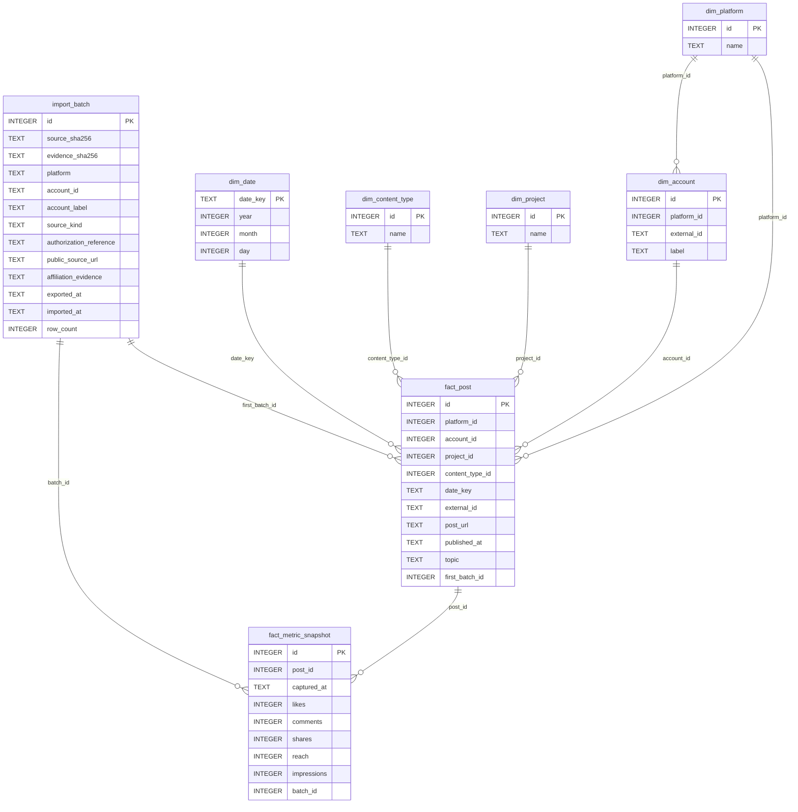

# Modelo físico generado desde `schema.sql`

```mermaid
erDiagram
  import_batch {
    INTEGER id PK
    TEXT source_sha256
    TEXT evidence_sha256
    TEXT platform
    TEXT account_id
    TEXT account_label
    TEXT source_kind
    TEXT authorization_reference
    TEXT public_source_url
    TEXT affiliation_evidence
    TEXT exported_at
    TEXT imported_at
    INTEGER row_count
  }
  dim_platform {
    INTEGER id PK
    TEXT name
  }
  dim_account {
    INTEGER id PK
    INTEGER platform_id
    TEXT external_id
    TEXT label
  }
  dim_project {
    INTEGER id PK
    TEXT name
  }
  dim_content_type {
    INTEGER id PK
    TEXT name
  }
  dim_date {
    TEXT date_key PK
    INTEGER year
    INTEGER month
    INTEGER day
  }
  fact_post {
    INTEGER id PK
    INTEGER platform_id
    INTEGER account_id
    INTEGER project_id
    INTEGER content_type_id
    TEXT date_key
    TEXT external_id
    TEXT post_url
    TEXT published_at
    TEXT topic
    INTEGER first_batch_id
  }
  fact_metric_snapshot {
    INTEGER id PK
    INTEGER post_id
    TEXT captured_at
    INTEGER likes
    INTEGER comments
    INTEGER shares
    INTEGER reach
    INTEGER impressions
    INTEGER batch_id
  }
  dim_platform ||--o{ dim_account : platform_id
  import_batch ||--o{ fact_post : first_batch_id
  dim_date ||--o{ fact_post : date_key
  dim_content_type ||--o{ fact_post : content_type_id
  dim_project ||--o{ fact_post : project_id
  dim_account ||--o{ fact_post : account_id
  dim_platform ||--o{ fact_post : platform_id
  import_batch ||--o{ fact_metric_snapshot : batch_id
  fact_post ||--o{ fact_metric_snapshot : post_id
```

## Granularidad

- `fact_post`: una fila por plataforma e ID de publicación.
- `fact_metric_snapshot`: una fila por publicación y momento de captura.
